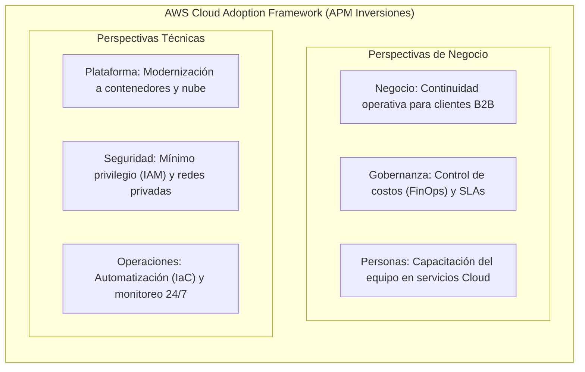
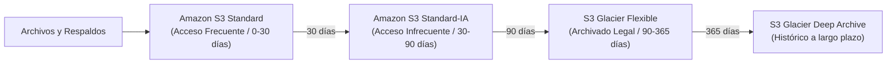
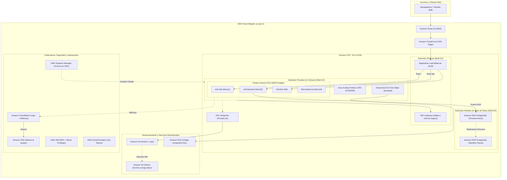

# Resumen Integral del Proyecto Cloud AWS — APM Inversiones EIRL

> **Documento de Consolidación Técnica para el Equipo**  
> **Proyecto:** Diseño e Implementación de Arquitectura Cloud Escalable, Tolerante a Fallos y de Alta Disponibilidad en AWS  
> **Institución:** SENATI — Formación Continua y Práctica Profesional  
> **Empresa Caso de Estudio:** APM Inversiones EIRL  
> **Alcance:** Fases 1, 2 y 3 (Diagnóstico, Servicios Core/Persistencia, Escalabilidad/Operaciones/IaC)

---

## 1. Visión Ejecutiva y Diagnóstico del Negocio

### 1.1 Perfil de la Organización
**APM Inversiones EIRL** es una empresa de base tecnológica del sector TI dedicada al desarrollo de software corporativo y servicios web para terceros (modalidad B2B). Sus líneas de servicio incluyen:
1. **Desarrollo por proyecto:** Plataformas web, tiendas virtuales y landing pages interactivas (ej. *Reflexo Perú*, *Arte & Ideas*).
2. **Plataformas propias:** Sistema interno de gestión de talento y operaciones (**SOFI**: frontend en Next.js, backend en NestJS y bot de asistencia en Discord).
3. **Hosting y soporte gestionado (MRR):** Alojamiento y mantenimiento continuo para los clientes.

### 1.2 La Problemática Crítica (Infraestructura Legacy)
Antes de esta propuesta, la empresa concentraba toda su operación en un **único Servidor Privado Virtual (VPS) en Hetzner Cloud** (3 vCPUs AMD EPYC, 3.7 GiB RAM, 0 B Swap, 75 GB SSD, con un costo de $16 USD/mes), apoyado en laptops personales de los desarrolladores:

| Dimensión | Situación Anterior (VPS Monolítico) | Impacto / Riesgo Técnico |
| :--- | :--- | :--- |
| **Disponibilidad** | VPS único sin redundancia física ni geográfica. | **Punto Único de Falla (SPOF)**: una caída del nodo dejaba fuera de línea a SOFI y a todos los clientes. |
| **Escalabilidad** | Recursos rígidos y estáticos (vCPU y RAM fijas). | Imposibilidad de escalar ante picos de demanda o eventos de marketing de los clientes. |
| **Bases de Datos** | Motor de base de datos compartiendo CPU/RAM con aplicaciones Node.js. | Degradación mutua por contención de recursos; sin respaldo automatizado ni alta disponibilidad. |
| **Almacenamiento** | Disco local del VPS para logs, backups y assets web. | Llenado imprevisto de disco que provocaba congelamiento de los servicios. |
| **Seguridad y Acceso**| Puerto SSH (22) expuesto a la Internet pública y credenciales compartidas. | Alta vulnerabilidad a ataques de fuerza bruta y carencia de trazabilidad de cambios. |
| **Operación** | Despliegues manuales mediante comandos directos por terminal. | Entornos desincronizados entre desarrollo y producción ("en mi máquina sí funciona"). |

---

## 2. Fase 1: Diagnóstico y Fundamentos Cloud

### 2.1 Adopción con AWS CAF (Cloud Adoption Framework)
Se aplicaron las 6 perspectivas del marco de adopción de AWS para estructurar la transformación técnica y organizacional:

### 2.2 Economía de la Nube y Análisis de TCO
- **Transición CapEx a OpEx:** Se elimina la necesidad de sobredimensionar hardware o pagar servidores ociosos; se adopta el modelo de pago por consumo (*Pay-as-you-go*).
- **Ahorro de Oportunidad:** Reducción drástica del costo por caída de servicio (Downtime Cost), protegiendo la reputación comercial y los acuerdos de nivel de servicio (SLA) con los clientes.

### 2.3 Gobierno de Identidades y Responsabilidad Compartida
- **Modelo de Responsabilidad Compartida:** AWS protege la infraestructura subyacente (hardware, regiones, cableado y centros de datos); APM Inversiones gestiona y asegura la configuración del sistema operativo, las aplicaciones, el cifrado de datos y las políticas de red.
- **AWS IAM (Identity and Access Management):**
  - Erradicación del usuario `root` para tareas cotidianas.
  - Implementación obligatoria de **MFA (Autenticación Multifactor)**.
  - Adopción estricta del **Principio de Menor Privilegio (PoLP)** mediante grupos y roles temporales vinculados a servicios (ej. roles de ejecución para ECS).

### 2.4 Diseño Conceptual de Red (Amazon VPC)
Se diseñó una red aislada **Amazon VPC (`10.0.0.0/16`)** desplegada en **2 Zonas de Disponibilidad (us-east-1a y us-east-1b)** dividida en cuatro capas de subredes:
1. **Subredes Públicas (`10.0.1.0/24`, `10.0.2.0/24`):** Albergan balanceadores de carga (ALB) y pasarelas de salida NAT Gateway.
2. **Subredes Privadas de Cómputo (`10.0.10.0/24`, `10.0.20.0/24`):** Alojamiento exclusivo de tareas ECS Fargate (`sofi-backend`, `sofi-web`, bot y clientes).
3. **Subred Privada de Desarrollo y Gestión (`10.0.30.0/24`):** Estaciones de trabajo EC2 Workstations accesibles exclusivamente por AWS Systems Manager (SSM).
4. **Subredes Aisladas de Base de Datos (`10.0.100.0/24`, `10.0.101.0/24`):** Sin acceso a Internet; comunicación restringida única y exclusivamente en el puerto 5432 hacia los contenedores autorizados.

---

## 3. Fase 2: Servicios Core, Almacenamiento y Persistencia

### 3.1 Capa de Cómputo Especializada e Híbrida
Se descartó el uso de servidores virtuales tradicionales para cargas productivas en favor de arquitecturas de contenedores serverless:

* **Amazon ECS con AWS Fargate (Cargas Productivas y Staging):**
  - Ejecución de microservicios y aplicaciones en contenedores Docker sin administrar instancias subyacentes ni parches de sistema operativo.
  - Asignación granular de recursos por tarea:
    - `sofi-backend` (NestJS): 0.50 vCPU / 1 GiB RAM.
    - `sofi-web` (Next.js): 0.25 vCPU / 512 MiB RAM.
    - `bot-asistencia-apm` (Discord Bot): 0.25 vCPU / 512 MiB RAM.
    - Aplicaciones web de clientes externos: 0.50 vCPU / 1 GiB RAM.
* **Amazon EC2 con volúmenes EBS gp3 (Estaciones de Desarrollo Virtuales):**
  - **Instancias Seleccionadas:** Familia `t3.small` (2 vCPU, 2 GiB RAM x86) con alternativa moderna en `t4g.small` (procesador AWS Graviton2 basado en arquitectura ARM64).
  - **¿Por qué se eligió la familia T (T3 / T4g) y no otra (C, M o R)?:**
    1. **Naturaleza de la Carga de Trabajo (Burstable Performance / Ráfagas):** El flujo de un desarrollador no demanda 100% de CPU continuo; pasa la mayor parte del tiempo escribiendo código, leyendo documentación o depurando (uso base de CPU entre 5% y 15%). Las instancias de la familia T acumulan *créditos de CPU* en reposo y los liberan a máxima potencia durante ráfagas intensas (ej. ejecutar `npm run build`, arrancar contenedores Docker locales o correr tests unitarios con Jest).
    2. **Costo Mínimo e Impacto FinOps:** Pagar por instancias de cómputo dedicado como la familia C (ej. `c5.large`) o M (`m5.large`) implicaría un sobredimensionamiento innecesario con costos 4 a 6 veces mayores. Una `t3.small` cuesta ~$0.0208 USD/hora; combinada con una política de apagado programado fuera de horario laboral (160 horas/mes), el costo mensual es de apenas **~$3.33 a $3.50 USD** por practicante.
    3. **Ventaja Competitiva de Graviton (`t4g`):** La familia `t4g` ofrece hasta un 40% mejor relación precio/rendimiento y un costo por hora 20% menor que `t3`, aprovechando que el stack tecnológico (Linux Ubuntu, Node.js y Python) compila nativamente en arquitectura ARM sin necesidad de emulación.
    4. **Almacenamiento Desacoplado `gp3`:** El uso de discos EBS `gp3` garantiza 3,000 IOPS base y 125 MB/s de tasa de transferencia sostenida sin depender de créditos de disco, acelerando la lectura/escritura de módulos (`node_modules`) y compilaciones.

### 3.2 Jerarquía de Almacenamiento y Ciclo de Vida de Datos
Se implementó una estrategia de almacenamiento por capas según la frecuencia de acceso y valor de la información:

* **Amazon S3 (Simple Storage Service):** Almacenamiento de alta durabilidad (99.999999999% - 11 nueves) para activos estáticos web, imágenes de clientes y volcados de respaldos.
* **Amazon EFS (Elastic File System):** Sistema de archivos NFS totalmente administrado, montable de manera simultánea en múltiples estaciones de desarrollo para compartir librerías de código y assets compartidos.

### 3.3 Persistencia Administrada con Amazon RDS y Resiliencia
* **Amazon RDS for PostgreSQL 16 (Instancia `db.t3.micro`):**
  - Migración desde el motor local compartido hacia una instancia administrada `db.t3.micro` (1 vCPU, 1 GiB RAM, 20 GB `gp3` cifrado con KMS) con arquitectura **Multi-AZ (Alta Disponibilidad Activo-Pasivo)** entre diferentes zonas de disponibilidad.
  - En caso de falla en la zona primaria, AWS ejecuta una conmutación por error automática (*failover*) sin intervención humana ni pérdida de datos.
* **Estrategia de Respaldo y Continuidad (RPO/RTO):**
  - **Snapshots diarios automatizados** replicados a Amazon S3.
  - **Recuperación en el Punto en el Tiempo (PITR - Point-in-Time Recovery):** Capacidad de restaurar la base de datos a cualquier segundo específico dentro de una ventana de retención de hasta 35 días, protegiendo ante borrados accidentales o corrupción de datos.

---

## 4. Fase 3: Escalabilidad, Seguridad Operativa, Observabilidad e IaC

### 4.1 Balanceo de Carga y Auto Scaling Dinámico
Para eliminar cuellos de botella y picos de tráfico en las aplicaciones web:
* **Application Load Balancer (ALB):**
  - Desplegado en las subredes públicas con terminación de cifrado TLS/SSL.
  - Enrutamiento inteligente basado en rutas y nombres de host (Host/Path Routing) para dirigir tráfico hacia los diferentes Target Groups de ECS (`/api` hacia el backend NestJS, `/` hacia Next.js).
  - Comprobaciones periódicas de estado (*Health Checks*) para expulsar automáticamente tareas no saludables.
* **Amazon ECS Auto Scaling:**
  - Políticas de **Target Tracking Scaling** fijadas al 70% de consumo de CPU/Memoria para añadir o drenar tareas automáticamente según la carga real.
  - Políticas de **Step Scaling** para responder de forma agresiva ante incrementos bruscos e impredecibles de peticiones.

### 4.2 Seguridad en Capas y Gestión sin Bastión Público
* **Grupos de Seguridad (Security Groups) en Cadena:**
  - El balanceador (ALB) es el único componente que acepta tráfico público en los puertos 80 y 443.
  - Las tareas de ECS únicamente aceptan conexiones provenientes del Security Group del ALB.
  - La base de datos RDS únicamente acepta conexiones en el puerto 5432 provenientes del Security Group de las tareas ECS.
* **Eliminación de Bastiones y SSH con AWS Systems Manager (SSM Session Manager):**
  - Se eliminan por completo los puertos SSH (22) abiertos a Internet y las llaves privadas `.pem`.
  - La administración de servidores se efectúa mediante canales HTTPS seguros cifrados con TLS y autenticados vía IAM y AWS CLI, generando bitácoras de auditoría de cada comando ejecutado.
* **VPC Endpoints (AWS PrivateLink):** Conexión privada directa desde la VPC hacia Amazon S3 y Amazon ECR, evitando el tránsito de datos por la Internet pública y reduciendo el consumo de NAT Gateway.

### 4.3 Observabilidad Centralizada y Gobierno FinOps
* **Amazon CloudWatch:**
  - Centralización de logs de contenedores (`awslogs`) con retención programada de 30 días para evitar sobrecostos.
  - Alarmas automáticas vinculadas a **Amazon SNS** para notificar al equipo técnico ante eventos críticos (consumo de CPU > 75%, tasa de errores HTTP 5XX > 1% o espacio en disco en BD < 20%).
* **Estrategia FinOps y Buenas Prácticas:**
  - Políticas obligatorias de etiquetado de recursos (*Tagging*): `Environment` (Dev/Prod), `Project` (SOFI/Clientes), `CostCenter` y `Owner`.
  - Auditoría continua mediante **AWS Trusted Advisor** para detectar recursos huérfanos, optimizar costos y verificar el cumplimiento de seguridad.

### 4.4 Infraestructura como Código (IaC) con AWS CloudFormation
Toda la arquitectura fue modelada en plantillas declarativas en formato YAML/JSON, organizadas en pilas (*stacks*) modulares:
1. `01-networking-vpc.yaml`: Creación de la VPC, subredes, tablas de ruteo y pasarelas.
2. `02-database-rds.yaml`: Creación de subredes de datos, grupos de parámetros e instancia RDS Multi-AZ.
3. `03-compute-ecs.yaml`: Creación del clúster ECS, definiciones de tareas Fargate, ALB y Target Groups.

**Beneficio:** Capacidad de clonar y desplegar un entorno completo de pruebas (Staging) o de producción en cuestión de minutos, con configuraciones estandarizadas y trazables en el repositorio Git.

---

## 5. Diagrama de Arquitectura Global End-to-End

---

## 6. Cuadro Comparativo: VPS Tradicional vs. Arquitectura AWS

| Atributo / Métrica | VPS Tradicional (Hetzner Cloud) | Solución Arquitectónica AWS |
| :--- | :--- | :--- |
| **Arquitectura** | Monolítica, concentrada en un único servidor. | Desacoplada, modular y basada en servicios administrados. |
| **Disponibilidad** | ~95.0% (sujeta a mantenimiento y fallas del host). | **> 99.95%** (distribuida en múltiples Zonas de Disponibilidad). |
| **Tolerancia a Fallos** | Nula. Si el nodo colapsa, todos los servicios caen. | Alta. Conmutación automática en RDS Multi-AZ y reemplazo de tareas ECS en minutos. |
| **Capacidad de Cómputo** | vCPU y memoria fijas. Riesgo de sobrecarga o gasto ocioso. | **Serverless elástica con Fargate**. Escalamiento automático en base a métricas. |
| **Persistencia de Datos** | Motor de BD local en el mismo disco del sistema. | **Amazon RDS administrado**, con backups automáticos y PITR de hasta 35 días. |
| **Seguridad de Red** | Puerto SSH (22) abierto a todo Internet; acceso mediante contraseñas/llaves fijas. | **Sin puertos de gestión abiertos**. Acceso mediante AWS SSM Session Manager y Security Groups encadenados. |
| **Almacenamiento** | Disco rígido local con riesgo de saturación. | **Amazon S3** ilimitado y ciclo de vida automatizado a **Glacier**, más **EFS** compartido. |
| **Observabilidad** | Manual vía `htop` o logs de texto dispersos en `/var/log`. | **Amazon CloudWatch unificado**, tableros de métricas en tiempo real y alertas por SNS. |
| **Mantenimiento y Despliegues** | Comandos manuales en terminal; entornos no reproducibles. | **Infraestructura como Código (IaC) con CloudFormation**, permitiendo despliegues automáticos y auditables. |

---

## 7. Puntos Clave para la Exposición y Defensa del Proyecto

Para que el equipo pueda sustentar el proyecto con solvencia técnica frente a los evaluadores o jurado, enfocar la defensa en estos cuatro pilares:

1. **Justificación del Desacoplamiento (No más monolitos):**
   - Explicar por qué separar la base de datos (RDS) de la lógica de negocio (Fargate) erradica el problema de contención de memoria que tumbaba el servidor anterior.
2. **Resiliencia y Disponibilidad Real (Multi-AZ):**
   - Subrayar que los componentes críticos (ALB, ECS Tasks y RDS) están distribuidos entre dos centros de datos independientes (Zonas de Disponibilidad), garantizando que si una zona sufre un corte eléctrico o inundación, el servicio sigue operando.
3. **Seguridad y Cero Exposición Pública (Zero Open Inbound Ports):**
   - Resaltar que ningún servidor o base de datos tiene una IP pública o puerto SSH abierto. Todo acceso administrativo pasa por el canal cifrado de **AWS Systems Manager** con autenticación IAM estricta.
4. **Eficiencia de Costos (FinOps):**
   - Destacar que AWS Fargate elimina el pago por servidores encendidos sin uso, y que la combinación de **S3 Standard + Glacier** minimiza el costo de almacenamiento de históricos y respaldos en más de un 80% comparado con discos EBS permanentes.
