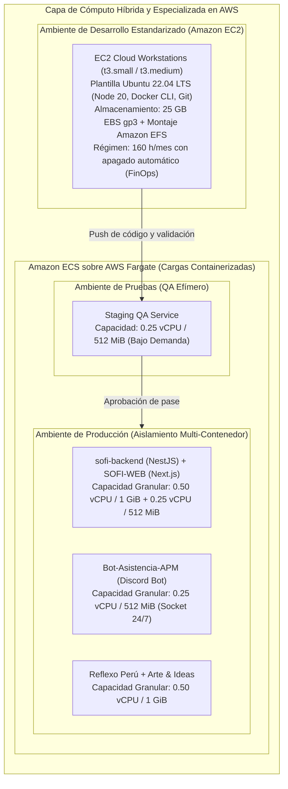
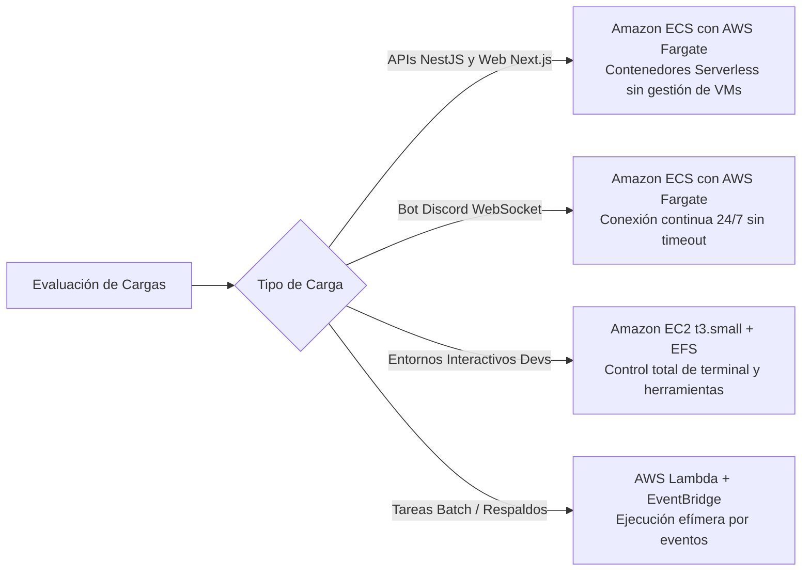
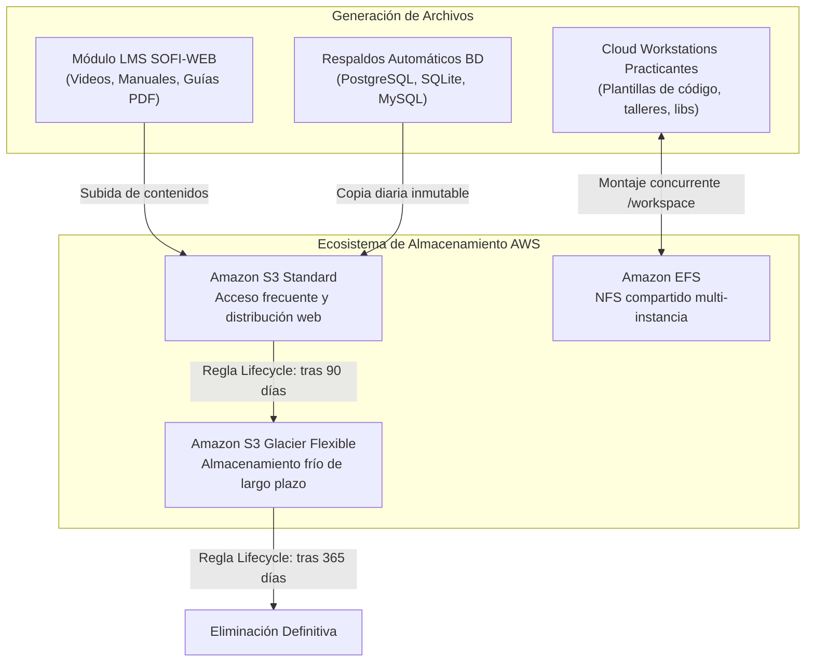
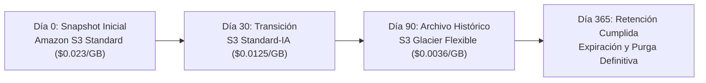
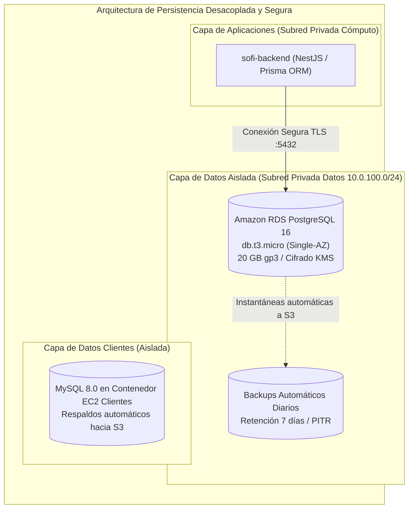

# SENATI - FORMACIÓN CONTINUA Y PRÁCTICA PROFESIONAL

## PROPUESTA DE PROYECTO: DISEÑO E IMPLEMENTACIÓN DE ARQUITECTURA CLOUD ESCALABLE, TOLERANTE A FALLOS Y DE ALTA DISPONIBILIDAD EN AWS PARA EL ÁREA DE DESARROLLO DE SOFTWARE

---

# ETAPA 2: Implementación de Servicios Core, Almacenamiento y Bases de Datos en la Nube

---

## 1. Diseño de la Capa de Computación y Servidores Cloud

El diseño de la capa de cómputo para **APM Inversiones EIRL** aborda de manera integral las necesidades del ciclo de vida del software (**Desarrollo, Pruebas y Producción**). La propuesta erradica la dependencia de un servidor monolítico compartido y la fragmentación en laptops personales mediante una arquitectura moderna y desacoplada: **Contenedores Serverless con Amazon ECS y AWS Fargate** para las cargas productivas y de staging, combinados con **instancias especializadas de Amazon Elastic Compute Cloud (Amazon EC2)** para las estaciones de desarrollo virtualizadas.

---

### 1.1 Selección y Configuración Propuesta de Cómputo

#### 1.1.1 Contenedores Serverless con Amazon ECS y AWS Fargate

En lugar de aprovisionar máquinas virtuales completas de la familia T3 para alojar servicios web, se adopta **AWS Fargate** como motor de ejecución serverless para contenedores Docker administrados bajo **Amazon ECS**:

* **Eliminación de la Sobrecarga Operativa:** Fargate abstrae por completo el sistema operativo subyacente. Se eliminan las tareas de parcheo del kernel de Linux, actualización de paquetes de seguridad, configuración de demonios Docker y mantenimiento de AMIs.
* **Aprovisionamiento y Dimensionamiento Granular:** Cada servicio consume únicamente los recursos que requiere, pagando por segundo de ejecución de vCPU y memoria RAM.

| Servicio / Contenedor | Tipo de Cómputo | vCPU Asignada | Memoria RAM | Almacenamiento Efímero | Propósito Arquitectónico |
|:---|:---:|:---:|:---:|:---:|:---|
| **`sofi-backend`** | AWS Fargate | `0.50 vCPU` | `1024 MiB (1 GiB)` | 20 GB Estándar | API REST/GraphQL en NestJS con Prisma ORM. Procesa lógica de negocio y persistencia en RDS. |
| **`SOFI-WEB`** | AWS Fargate | `0.25 vCPU` | `512 MiB (0.5 GiB)` | 20 GB Estándar | Frontend institucional en Next.js (SSR / Servidor Node ligero). |
| **`Bot-Asistencia-APM`** | AWS Fargate | `0.25 vCPU` | `512 MiB (0.5 GiB)` | 20 GB Estándar | Proceso persistente con conexión WebSocket 24/7 hacia la Gateway API de Discord. |
| **Clientes (Reflexo / Arte & Ideas)** | AWS Fargate | `0.50 vCPU` | `1024 MiB (1 GiB)` | 20 GB Estándar | Contenedores comerciales desacoplados. Los picos de tráfico externo quedan confinados sin afectar a SOFI. |
| **Staging / QA (Pruebas)** | AWS Fargate | `0.25 vCPU` | `512 MiB (0.5 GiB)` | 20 GB Estándar | Despliegue de réplicas de prueba efímeras para validación de integración previa a producción. |

#### 1.1.2 Estaciones de Desarrollo Virtuales: Amazon EC2

Para el ambiente de desarrollo de practicantes se mantiene **Amazon EC2**, donde la flexibilidad de una máquina virtual interactiva es insustituible:

* **Especificaciones:** Instancias `t3.small` (2 vCPU, 2 GiB RAM) con opción de escalamiento temporal a `t3.medium` para compilaciones pesadas.
* **Estandarización de Herramientas:** Imagen base unificada con Ubuntu 22.04 LTS, Node.js 20, Python 3, Docker CLI y Git, erradicando el síndrome de "en mi máquina sí funciona".
* **FinOps y Ahorro:** Programación de apagado automático fuera del horario de prácticas (160 horas mensuales), reduciendo el costo mensual de la estación a menos de **$3.50 USD**.

#### 1.1.3 Estrategia de Almacenamiento en Cómputo: Efímero vs. Amazon EBS (`gp3`)

1. **Almacenamiento Efímero en AWS Fargate:** Cada tarea de Fargate dispone de **20 GB de almacenamiento efímero cifrado** incluido sin costo adicional, suficiente para el sistema de archivos del contenedor, capas intermedias y logs transitorios. Dado que los contenedores son sin estado (*stateless*), cualquier persistencia requerida se delega a Amazon RDS o Amazon S3.
2. **Amazon EBS General Purpose SSD (`gp3`) para EC2 Workstations:**
   - Se asigna un volumen raíz de **25 GB `gp3`** por estación de desarrollo.
   - Entrega **3,000 IOPS sostenidos y 125 MB/s de rendimiento base** sin depender del tamaño del disco ni requerir acumulación de créditos de ráfaga como en `gp2`.
   - Tarifa un 20% más económica ($0.08 USD/GB-mes).

---

### 1.2 Evaluación de Arquitecturas Modernas: Contenedores Serverless vs. Monolito VM vs. Lambda

Se evalúa la viabilidad técnica de las distintas alternativas de cómputo para el ecosistema de **APM Inversiones EIRL**:

#### 1.2.1 Análisis Comparativo de Tecnologías

| Criterio de Decisión | Monolito en EC2 (Familia T3) | AWS Lambda (Serverless Funcional) | Amazon ECS con AWS Fargate (Elección Final) |
|:---|:---|:---|:---|
| **Gestión Operativa de SO** | **Alta:** Requiere parches de kernel, gestión de AMIs y monitoreo de disco en cada VM. | **Nula:** Totalmente abstraído por AWS. | **Nula:** Gestión de contenedores sin servidores. Solo se administra la imagen Docker. |
| **Dimensionamiento de Recursos** | **Rígido:** Limitado a los tamaños predefinidos de la familia T (ej. `t3.small` 2GB, `t3.medium` 4GB). Riesgo de sobrecosto. | **Por función:** Límite estricto de 15 minutos de ejecución. | **Granular:** Selección exacta de vCPU (desde 0.25) y memoria (desde 512 MiB) por contenedor. |
| **Soporte `Bot-Asistencia-APM`** | **Excelente:** Admite sockets continuos, pero depende de la salud de una única VM. | **Inviable:** El bot requiere socket WebSocket continuo (Gateway Discord); Lambda se apaga a los 15 min. | **Excelente:** Tareas continuas 24/7 con reinicio y autorecuperación automática. |
| **Comportamiento ante Picos** | Lento (3 a 5 min para que un Auto Scaling Group levante una VM EC2). | Inmediato, pero con impacto severo de *Cold Starts* y saturación de conexiones en PostgreSQL. | **Rápido (segundos):** Las tareas de Fargate se levantan y colocan en el Target Group casi al instante. |
| **Impacto de Créditos de CPU** | Las instancias T3 agotan créditos bajo carga sostenida y se degradan. | No aplica. | **Rendimiento predecible:** Fargate entrega la capacidad de cómputo asignada de forma 100% dedicada. |

---

### 1.3 Arquitectura de Identidades y Seguridad con AWS IAM

Para resolver de raíz los riesgos de seguridad y garantizar una administración robusta, se define una separación estricta entre **identidades humanas** e **identidades de cómputo (servicios y máquinas)**.

```mermaid
flowchart TD
    subgraph IAM_MODEL["Modelo Integral de AWS Identity and Access Management (IAM)"]
        direction TB

        subgraph HUMAN_ID["1. Identidades Humanas (Personas)"]
            direction TB
            ROOT["Cuenta Root (MFA Físico Obligatorio)<br/>Prohibida para operaciones cotidianas; solo facturación"]
            USERS["Usuarios Individuales IAM (jhefry-dev, lead-arch)<br/>MFA Obligatorio | Cero llaves estáticas permanentes"]
            GRP_ADMIN["Grupo IAM: Admins-CloudOps<br/>Política: Acceso administrativo acotado + Control de IaC"]
            GRP_DEV["Grupo IAM: Developers-Practicantes<br/>Política: Acceso a EC2 Dev y Staging; Deny explícito a Prod"]
            USERS -->|Heredan permisos de| GRP_ADMIN
            USERS -->|Heredan permisos de| GRP_DEV
        end

        subgraph MACHINE_ID["2. Identidades de Cómputo (Servicios y Tareas)"]
            direction TB
            subgraph EC2_IAM["Para Instancias EC2 (Cloud Workstations)"]
                R_EC2["IAM Role: EC2-DevWorkstation-Role<br/>Permisos: AmazonSSMManagedInstanceCore, S3ReadLMS, EFSMount"]
                IP_EC2["EC2 Instance Profile<br/>(Contenedor que asocia el Rol a la VM)"]
                VM_EC2["Instancia EC2 Ubuntu Workstation"]
                R_EC2 --> IP_EC2 --> VM_EC2
            end

            subgraph ECS_IAM["Para Contenedores en AWS Fargate"]
                TER["ECS Task Execution Role<br/>(Usado por el plano de AWS Fargate)"]
                TER_POL["Permisos:<br/>- AmazonECSTaskExecutionRolePolicy (Pull ECR, Logs CloudWatch)<br/>- ssm:GetParameters (Inyección segura de variables de entorno)"]
                TR["ECS Task Role<br/>(Usado por el código NestJS / Next.js)"]
                TR_POL["Permisos:<br/>- s3:GetObject / PutObject (Bucket LMS)<br/>- ses:SendEmail (Notificaciones)"]
                FARGATE_CONTAINER["Contenedor en Ejecución (sofi-backend / web)"]

                TER --- TER_POL --> FARGATE_CONTAINER
                TR --- TR_POL --> FARGATE_CONTAINER
            end
        end
    end
```

#### 1.3.1 Identidades Humanas: Usuarios, Grupos y Menor Privilegio
1. **Regla de Oro:** Se prohíbe la asignación directa de políticas a usuarios individuales. Los permisos se asocian únicamente a **Grupos de Usuarios IAM**, respetando el principio de menor privilegio (*Principle of Least Privilege - PoLP*).
2. **Grupo `Developers-Practicantes`:** Concede acceso exclusivo para iniciar sesión en sus estaciones EC2 a través de **AWS Systems Manager (SSM Session Manager)** y desplegar sobre el entorno de *Staging*. Posee una regla explícita de denegación (`Deny`) sobre recursos con etiquetas `Environment = Production`.
3. **Erradicación de Llaves Estáticas:** Se bloquea la generación de `AWS_ACCESS_KEY_ID` y `AWS_SECRET_ACCESS_KEY` para colaboradores. La autenticación se realiza mediante la consola con MFA o mediante credenciales temporales generadas vía AWS CLI autenticado.

#### 1.3.2 Identidades de Máquina en EC2: IAM Roles e Instance Profiles
Una instancia virtual EC2 no puede asumir un IAM Role de manera directa. Requiere un **Instance Profile**:
* **Definición:** El *Instance Profile* es un contenedor lógico que aloja el IAM Role y lo expone al servicio de metadatos de la instancia (`http://169.254.169.254/latest/meta-data/iam/`).
* **Función en las Workstations:** El rol `EC2-DevWorkstation-Role` permite que la máquina se registre automáticamente contra **AWS Systems Manager** (eliminando llaves SSH en el puerto 22) y monte el sistema de archivos **Amazon EFS** sin necesidad de credenciales quemadas en el sistema operativo.

#### 1.3.3 Identidades de Contenedores en ECS Fargate: Dual Role
En Fargate no existen máquinas virtuales ni *Instance Profiles*. En su lugar, la seguridad se gestiona a nivel de contenedor con una estricta dualidad de roles:

1. **ECS Task Execution Role (`ecsTaskExecutionRole`):**
   - **Quién lo asume:** El agente y plano de control de AWS ECS/Fargate antes de que arranque tu aplicación.
   - **Propósito:** Concede permisos para autenticarse y descargar imágenes privadas de contenedor desde **Amazon ECR**, crear los flujos de log y escribir trazas en **Amazon CloudWatch Logs**, y extraer secretos de base de datos cifrados desde **AWS Secrets Manager** o **SSM Parameter Store** para inyectarlos como variables de entorno seguras.
2. **ECS Task Role (`sofiBackendTaskRole`):**
   - **Quién lo asume:** El código fuente de la aplicación en ejecución (`sofi-backend`, `SOFI-WEB` o el Bot de Discord) dentro del contenedor.
   - **Propósito:** Concede acceso granular a las APIs de AWS requeridas por el software (por ejemplo: subir archivos multimedia a los buckets de **Amazon S3** o enviar correos de confirmación mediante **Amazon SES**), garantizando que el código no tenga acceso a ningún otro recurso fuera de su dominio.

---

## 2. Estrategia de Almacenamiento y Archivo de Datos

La estrategia de almacenamiento resuelve tres necesidades críticas de la empresa:
1. Almacenamiento elástico e ilimitado para el módulo educativo LMS de SOFI sin llenar el disco del servidor.
2. Sistema de archivos compartido para las estaciones de desarrollo de practicantes y entornos de pruebas.
3. Retención segura y de bajo costo para el archivo histórico y cumplimiento normativo de respaldos.

---

### 2.1 Propuesta de Uso para Amazon S3 y Amazon EFS

#### 2.1.1 Amazon S3 (Simple Storage Service): Repositorio de Objetos Elástico

* **Propósito en la Plataforma:**
  - **Material Formativo LMS:** Videos instructivos, diapositivas y guías técnicas en PDF consumidas por los practicantes desde `SOFI-WEB`.
  - **Activos Estáticos de Clientes:** Logotipos, catálogos e imágenes optimizadas de Reflexo Perú y Arte & Ideas.
  - **Repositorio de Backups:** Depósito destino de volcados (*dumps*) cifrados de las bases de datos.
* **Configuración y Buenas Prácticas:**
  - **Control de Acceso Seguro:** Bloqueo público total (*Block Public Access*) a nivel de bucket. La entrega de contenidos web se realiza a través de URLs prefirmadas (*Presigned URLs*) o mediante distribución segura con **Amazon CloudFront** utilizando *Origin Access Control (OAC)*.
  - **Versionado de Objetos (Versioning):** Activado para proteger los materiales didácticos y respaldos contra borrados accidentales o modificaciones indebidas.
  - **Cifrado en Reposo:** Cifrado automático mediante claves administradas por AWS (**SSE-S3** / AES-256) sin costo adicional.

#### 2.1.2 Amazon EFS (Elastic File System): Sistema de Archivos Compartido para Desarrollo

* **Propósito en la Plataforma:**
  - Proveer un volumen compartido basado en el protocolo **NFSv4** montado simultáneamente en todas las estaciones de trabajo virtuales de los practicantes (`EC2-DEV`) y en el servidor de pruebas (`EC2-STAGE`).
* **Beneficios Técnicos y Operativos:**
  - **Homogeneización del Espacio de Trabajo:** Todos los practicantes tienen acceso al directorio `/shared/workspace` donde residen plantillas de proyectos, datasets de prueba sintéticos y manuales de estándares de codificación.
  - **Ahorro de Almacenamiento Local:** Las librerías de dependencias pesadas y módulos compartidos no se duplican en cada disco EBS individual.
  - **Elasticidad Automática:** Crece y decrece automáticamente a medida que se agregan o eliminan archivos, pagando estrictamente por los gigabytes consumidos.
  - **Alta Disponibilidad Multi-AZ:** Los datos se replican automáticamente en múltiples Zonas de Disponibilidad dentro de la región.

---

### 2.2 Políticas de Retención y Archivado con Amazon S3 Glacier

Para cumplir con la gobernanza de datos y minimizar el gasto en almacenamiento sin comprometer la seguridad, se configuran **Reglas de Ciclo de Vida (S3 Lifecycle Policies)** automatizadas:

#### 2.2.1 Definición de Reglas de Ciclo de Vida

1. **Fase Activa (0 a 30 días) - Amazon S3 Standard:**
   - Los respaldos diarios de PostgreSQL y los datos de clientes permanecen disponibles de forma inmediata para recuperación instantánea ante cualquier contingencia operativa. Tarifa: **$0.023 USD/GB**.
2. **Fase Intermedia (31 a 90 días) - S3 Standard-IA (Infrequent Access):**
   - Respaldos con baja probabilidad de consulta pero que requieren acceso en milisegundos si se realiza una auditoría mensual. Tarifa: **$0.0125 USD/GB** (reducción del 45%).
3. **Fase de Archivo Histórico (91 a 365 días) - Amazon S3 Glacier Flexible Retrieval:**
   - Los datos se comprimen y archivan para respaldo legal e histórico. El tiempo de recuperación oscila entre 1 y 5 minutos (Expedited) o de 3 a 5 horas (Standard). Tarifa: **$0.0036 USD/GB** (**ahorro superior al 84%** respecto a S3 Standard).
4. **Expiración Definitiva (> 365 días):**
   - Los archivos que superan un año de antigüedad son purgados automáticamente por la política de AWS, evitando acumulación de almacenamiento obsoleto y costos residuales.

---

## 3. Implementación de Bases de Datos Administradas

La persistencia de datos representaba el talón de Aquiles del diagnóstico inicial, donde PostgreSQL y MySQL competían sobre 3.7 GiB de RAM en el VPS sin memoria swap ni aislamiento. La solución traslada las cargas hacia motores gestionados de bases de datos relacionales en **Amazon Relational Database Service (Amazon RDS)**.

---

### 3.1 Selección del Motor de Base de Datos Óptimo

Se seleccionó **Amazon RDS for PostgreSQL (Versión 16)** como el motor administrado para el núcleo transaccional del Ecosistema SOFI:

#### 3.1.1 Cuadro Comparativo de Motores Evaluados

| Criterio Técnico | Amazon RDS for PostgreSQL 16 (Seleccionado) | Amazon Aurora PostgreSQL | Amazon DynamoDB (NoSQL) | Amazon RDS for MySQL |
|:---|:---|:---|:---|:---|
| **Modelo de Datos** | Relacional (RDBMS) | Relacional (RDBMS) | NoSQL (Clave-Valor / Documentos) | Relacional (RDBMS) |
| **Compatibilidad con Código Existente** | **100% Nativo:** Utiliza Prisma ORM y scripts SQL de NestJS ya construidos. Cero cambios de código. | **100% Nativo:** Compatible con el motor PostgreSQL. | **0% Compatible:** Obligaría a reescribir esquemas, consultas, validaciones y relaciones en Prisma. | **Baja:** El backend de SOFI está modelado con sintaxis y tipos nativos de PostgreSQL. |
| **Integridad Transaccional** | Cumplimiento ACID completo con claves foráneas, restricciones y triggers. | Cumplimiento ACID completo con alta disponibilidad nativa. | Consistencia eventual configurable; sin soporte nativo para integridad relacional foránea compleja. | Cumplimiento ACID completo. |
| **Costo Base de Entrada** | **Bajo ($15.44 USD/mes):** Instancia `db.t3.micro` con 20 GB `gp3`. Ajustado al presupuesto educativo. | **Elevado (~$40 a $50 USD/mes):** Sobredimensionado para la carga inicial de practicantes. | Variable por petición; económico al inicio pero complejo para consultas relacionales y reportes. | Similar a RDS PostgreSQL (~$15.00 USD/mes). |
| **Mantenimiento Operativo** | Parches automáticos, respaldos continuos y métricas de CPU/conexiones en CloudWatch. | Totalmente administrado con auto-reparación de almacenamiento. | Totalmente sin servidor, sin parches ni mantenimiento de SO. | Totalmente administrado por AWS. |

---

### 3.2 Justificación Técnica del Motor Seleccionado según Cargas de Trabajo

1. **Alineación con el Stack Tecnológico de SOFI:**
   - La arquitectura de `sofi-backend` está construida sobre **NestJS y Prisma ORM**, estructurada alrededor de modelos altamente relacionales: `User`, `AttendanceRecord`, `Role`, `Schedule`, `Course` y `Submission`.
   - Modificar este esquema hacia una base NoSQL como DynamoDB destruiría las garantías de consistencia transaccional y obligaría al equipo a invertir semanas rediseñando modelos y consultas de agregación para reportes de asistencia.
2. **Eficiencia y Estabilidad frente al Escenario VPS Anterior:**
   - En el VPS anterior, PostgreSQL sufría de riesgo de terminación por *OOM Killer* al compartir memoria con otros servicios. Al migrar a **Amazon RDS `db.t3.micro` (1 vCPU, 1 GiB RAM)** con memoria y CPU dedicadas, el motor opera con buffers de memoria aislados y parámetros optimizados por AWS (`shared_buffers`, `work_mem`).
3. **Mecanismo de Recuperación ante Desastres (RPO y RTO):**
   - **Copias de Seguridad Automatizadas:** RDS realiza un respaldo diario completo del volumen y captura los registros de transacciones (*WAL logs*) cada 5 minutos.
   - **Restauración en el Tiempo (*Point-In-Time Restore - PITR*):** Permite restaurar la base de datos a cualquier segundo específico dentro de la ventana de retención (7 días configurados), mitigando errores humanos como borrados accidentales de tablas de asistencia.
4. **Seguridad y Cifrado Nativo:**
   - La base de datos reside en una subred privada sin acceso a Internet (`10.0.100.0/24`). Solo acepta tráfico en el puerto `5432` proveniente del Grupo de Seguridad (*Security Group*) de la instancia EC2 de SOFI.
   - El almacenamiento de datos en reposo se cifra mediante **AWS Key Management Service (AWS KMS)** con cifrado estándar AES-256.

---

## 4. Cuadro Consolidado de Especificaciones de la Fase 2

| Pilar Arquitectónico | Recurso AWS | Especificación / Modelo | Capacidad / Rendimiento | Mecanismo de Aislamiento / Seguridad |
|:---|:---|:---|:---|:---|
| **Cómputo Producción (SOFI)** | Amazon ECS / AWS Fargate | Contenedores Serverless (`sofi-backend`, `SOFI-WEB`, `Bot`) | Granular: 0.50 vCPU/1 GiB (API) + 0.25 vCPU/512 MiB (Web y Bot) | Subredes privadas; modo `awsvpc`; `ecsTaskExecutionRole` para ECR/Logs y `sofiTaskRole` para S3. |
| **Cómputo Clientes** | Amazon ECS / AWS Fargate | Contenedores Serverless (Reflexo Perú y Arte & Ideas) | Granular: 0.50 vCPU / 1024 MiB | Aislamiento lógico total frente a SOFI; tareas en subredes privadas sin IP pública. |
| **Cómputo Pruebas (QA)** | Amazon ECS / AWS Fargate | Tareas efímeras bajo demanda | Granular: 0.25 vCPU / 512 MiB | Despliegue efímero en subred de staging; ejecución y destrucción controlada por CI/CD. |
| **Cómputo Desarrollo** | Amazon EC2 | `t3.small` (Ubuntu 22.04 LTS) | 2 vCPU / 2 GiB RAM / 25 GB EBS `gp3` | Asociada a **EC2 Instance Profile** (`EC2-DevWorkstation-Role`); acceso exclusivo vía SSM Session Manager. |
| **Almacenamiento Objetos** | Amazon S3 | S3 Standard / S3 Glacier | Elástico (Escala automática) | Acceso restringido por OAC y CloudFront; versionado activo; cifrado SSE-S3. |
| **Archivos Compartidos** | Amazon EFS | Elastic General Purpose | Elástico con montaje NFSv4 multi-AZ | Montaje en subred privada para `/shared/workspace` de practicantes en las Cloud Workstations. |
| **Base de Datos** | Amazon RDS | PostgreSQL 16 (`db.t3.micro`) | 1 vCPU / 1 GiB RAM / 20 GB `gp3` | Subred privada de datos; cifrado KMS; backups continuos PITR (7 días); acceso solo desde SG de tareas Fargate. |
| **Gobierno e Identidad** | AWS IAM | Usuarios, Grupos, Roles y Profiles | Principio de Menor Privilegio (PoLP) | MFA obligatorio; sin llaves permanentes; separación de identidades humanas y roles de cómputo. |

---

## 5. Conclusiones y Preparación para la Etapa 3

La implementación diseñada en esta **Etapa 2** cumple rigurosamente con los objetivos curriculares de SENATI y moderniza la infraestructura de **APM Inversiones EIRL**:

1. **Modernización a Contenedores Serverless (Fargate):** Se eliminó la sobrecarga de parches y dimensionamiento rígido de máquinas virtuales para los servicios web y bots, asignando capacidades exactas de vCPU y memoria por contenedor.
2. **Claridad y Solidez en la Capa de Identidad (IAM):** Se erradicó la confusión clásica entre accesos humanos y credenciales de servicio, separando **Grupos de Usuarios con menor privilegio** de las identidades de cómputo (**Instance Profiles en EC2** para workstations y la dualidad **Task Execution Role / Task Role en ECS Fargate**).
3. **Persistencia Profesional y Alta Resiliencia:** La base de datos PostgreSQL ahora cuenta con respaldo continuo automatizado y aislamiento de red en Amazon RDS.
4. **Fundación para la Etapa 3:** Esta infraestructura basada en tareas Fargate desacopladas y roles bien delimitados es el punto de partida perfecto para la Etapa 3, donde se integrará el balanceador de carga (**Application Load Balancer**), el autoescalado reactivo de contenedores (**ECS Service Auto Scaling**), el monitoreo con **CloudWatch Container Insights** y el despliegue automatizado con **AWS CloudFormation**.

