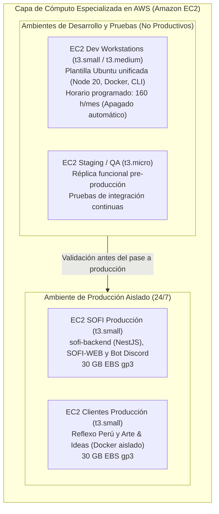
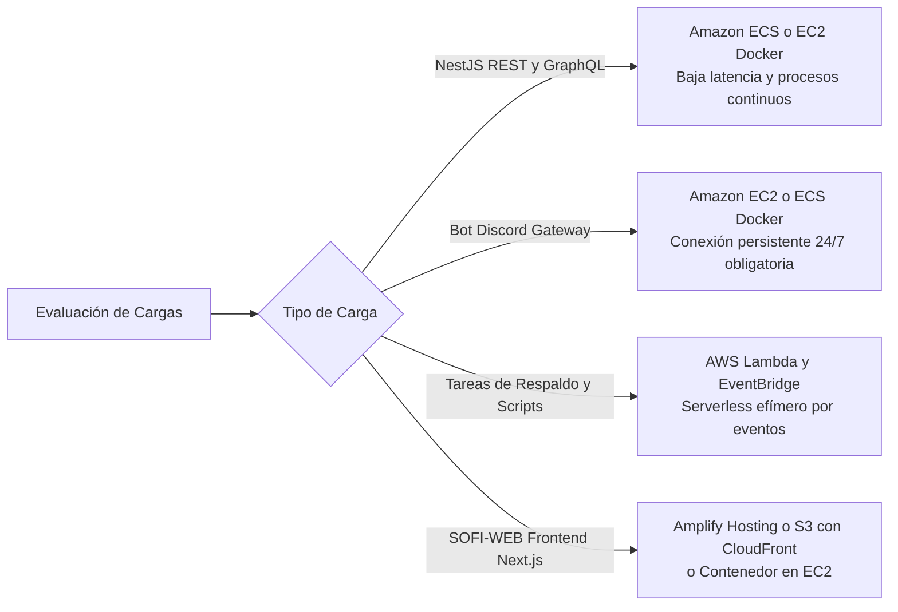
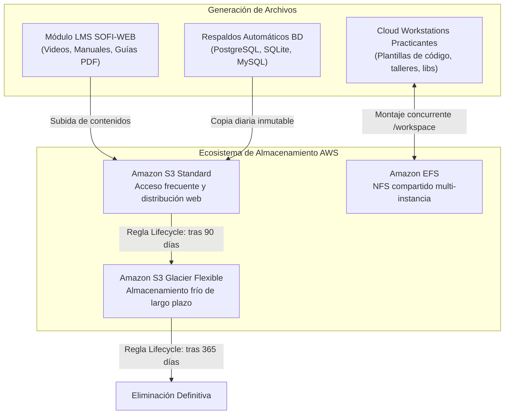
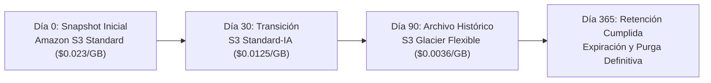
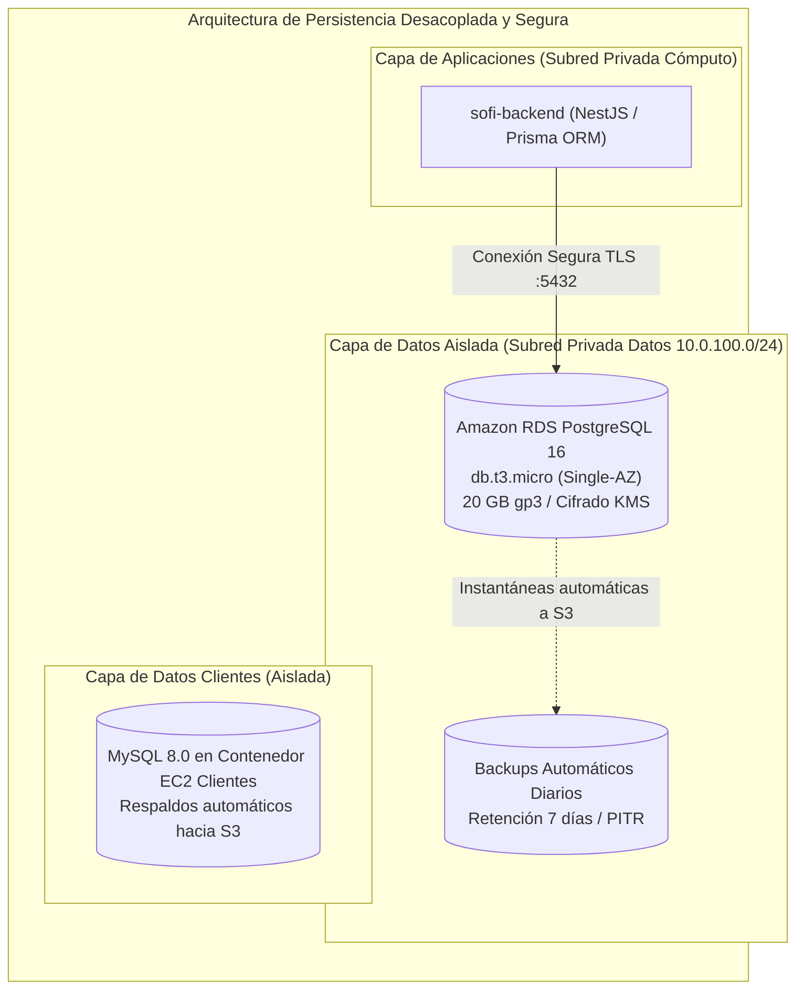

# SENATI - FORMACIÓN CONTINUA Y PRÁCTICA PROFESIONAL

## PROPUESTA DE PROYECTO: DISEÑO E IMPLEMENTACIÓN DE ARQUITECTURA CLOUD ESCALABLE, TOLERANTE A FALLOS Y DE ALTA DISPONIBILIDAD EN AWS PARA EL ÁREA DE DESARROLLO DE SOFTWARE

---

# ETAPA 2: Implementación de Servicios Core, Almacenamiento y Bases de Datos en la Nube

---

## 1. Diseño de la Capa de Computación y Servidores Cloud

El diseño de la capa de cómputo para **APM Inversiones EIRL** aborda de manera integral las necesidades del ciclo de vida del software (**Desarrollo, Pruebas y Producción**). La propuesta erradica la dependencia de un servidor monolítico compartido y la fragmentación de desarrollo en máquinas personales, implementando instancias virtuales escalables, seguras y especializadas en **Amazon Elastic Compute Cloud (Amazon EC2)**.

---

### 1.1 Selección y Configuración Propuesta de Instancias Amazon EC2

Para equilibrar costo, rendimiento predecible y aislamiento de fallas, se adopta la familia de instancias **T3 (Uso General con Capacidad de Ráfaga)** sustentadas sobre procesadores Intel Xeon Platinum de 2.5 GHz o AMD EPYC de hasta 3.1 GHz con tecnología de virtualización basada en el hipervisor **AWS Nitro System**:

#### 1.1.1 Especificaciones de Instancias por Ambiente

| Servidor / Instancia | Tipo de Instancia | vCPU / RAM | Sistema Operativo | Almacenamiento EBS | Régimen / Modalidad de Compra | Propósito Arquitectónico |
|:---|:---:|:---:|:---:|:---:|:---:|:---|
| **EC2 SOFI (Producción)** | `t3.small` | 2 vCPU / 2 GiB | Ubuntu 22.04 LTS | 30 GB `gp3` | On-Demand (24/7 - 730 h/mes) | Aloja `sofi-backend` (NestJS/Prisma), `SOFI-WEB` (Next.js) y `Bot-Asistencia-APM`. Desacoplado de bases de datos y clientes. |
| **EC2 Clientes (Producción)** | `t3.small` | 2 vCPU / 2 GiB | Ubuntu 22.04 LTS | 30 GB `gp3` | On-Demand (24/7 - 730 h/mes) | Aloja contenedores comerciales de Reflexo Perú y Arte & Ideas. Garantiza que picos de tráfico externo no degraden la plataforma formativa interna. |
| **EC2 Staging (Pruebas / QA)** | `t3.small` / `t3.micro` | 1-2 vCPU / 1-2 GiB | Ubuntu 22.04 LTS | 20 GB `gp3` | **Spot Instance** (Bajo demanda / 160 h/mes) | Entorno espejo pre-producción bajo **Amazon EC2 Spot Instances** (hasta 70-90% de ahorro). Pruebas funcionales e integración tolerantes a interrupción temporal. |
| **EC2 Cloud Workstations (Desarrollo y Capacitaciones)** | `t3.small` | 2 vCPU / 2 GiB | Ubuntu 22.04 LTS | 25 GB `gp3` + Amazon EFS | On-Demand programado (160 h/mes) | Estación virtual estandarizada para practicantes. Contiene Node.js 20, Python 3, Docker y herramientas unificadas, eliminando la disparidad de laptops personales. |

#### 1.1.2 Selección y Opciones de Almacenamiento en Bloque: Amazon EBS (`gp3`)

Para el almacenamiento raíz del sistema operativo y los contenedores Docker, se descartan los antiguos volúmenes `gp2` y se estandariza el uso de **Amazon EBS General Purpose SSD (`gp3`)**:

1. **Rendimiento Base Independiente del Volumen:**
   - A diferencia de `gp2`, donde el rendimiento en IOPS depende directamente del tamaño en gigabytes (3 IOPS por GB con necesidad de acumular créditos de ráfaga), los volúmenes `gp3` entregan **3,000 IOPS sostenidos y 125 MB/s de rendimiento base sin costo adicional**, independientemente de si el disco tiene 20 GB o 100 GB.
2. **Ahorro Directo en Costos:**
   - La tarifa por gigabyte de `gp3` ($0.08 USD/GB-mes) representa un **ahorro inmediato del 20%** frente a la tarifa de `gp2` ($0.10 USD/GB-mes).
3. **Escalabilidad Elástica en Caliente (Elastic Volumes):**
   - Los volúmenes EBS en AWS permiten ampliar capacidad de disco, modificar IOPS o alternar tipo de almacenamiento en tiempo de ejecución sin reiniciar las instancias ni provocar tiempo de inactividad (*downtime*).

#### 1.1.3 Estrategia de Cómputo para Pruebas: Amazon EC2 Spot Instances

Para maximizar la eficiencia presupuestal en el ambiente de pruebas (*Staging/QA*), se implementa la modalidad de compra **Amazon EC2 Spot Instances**:

* **Fundamento Técnico:** AWS comercializa su capacidad de cómputo ociosa con descuentos de hasta un **70% a 90%** en comparación con las tarifas *On-Demand*. Como contraprestación, AWS puede reclamar la instancia si la demanda global de capacidad aumenta, emitiendo una notificación de interrupción (*Spot Instance Interruption Notice*) con **2 minutos de anticipación**.
* **Idoneidad para el Entorno de Pruebas:**
  - El ambiente de *Staging* no presta servicios a clientes finales ni requiere disponibilidad ininterrumpida 24/7. Su único propósito es validar despliegues, ejecutar pruebas de integración y verificar endpoints.
  - Una interrupción ocasional durante la noche o fuera de horas de prueba tiene impacto operacional nulo sobre la empresa.
* **Mecanismos de Resiliencia ante Interrupciones:**
  1. **Comportamiento de Interrupción (*Stop Behavior*):** Se configura la instancia Spot con comportamiento de detención (*Stop*) en lugar de terminación (*Terminate*). Cuando AWS reclama la capacidad, el sistema operativo se apaga de forma limpia conservando el volumen EBS intacto; al restablecerse la capacidad Spot, la instancia se reinicia exactamente en el estado previo.
  2. **Aprovisionamiento Automatizado mediante User Data:** Al estar la suite de pruebas y los servicios empaquetados en contenedores Docker y versionados en GitHub, cualquier nueva instancia Spot de reemplazo se auto-configura en menos de dos minutos ejecutando el script de inicio (*User Data*).
* **Beneficio Económico Concreto (Referencia `us-east-1`):**
  - Instancia `t3.small` On-Demand: ~$0.0208 USD/hora (~$3.33 USD por 160 horas mensuales de pruebas).
  - Instancia `t3.small` en modalidad **Spot**: ~$0.0062 USD/hora (~**$0.99 USD** por 160 horas mensuales), logrando una reducción del **70%** en el costo de cómputo de pruebas y permitiendo incluso probar sobre instancias de mayor capacidad técnica a una fracción del costo normal.

---

### 1.2 Evaluación de Arquitecturas Modernas: Contenedores vs. Serverless

Se realiza un análisis de viabilidad técnica para determinar si el software de la empresa debe migrar a esquemas sin servidor (**AWS Lambda**), plataformas administradas (**AWS Elastic Beanstalk**) o contenedores orquestados (**Docker / Amazon ECS**):

#### 1.2.1 Análisis Comparativo de Tecnologías

| Criterio de Decisión | Docker sobre Amazon EC2 (Selección Fase Actual) | AWS Elastic Beanstalk | AWS Lambda (Serverless) | Amazon ECS / AWS Fargate (Roadmap Fase 3) |
|:---|:---|:---|:---|:---|
| **Compatibilidad con `Bot-Asistencia-APM`** | **Excelente:** Admite conexiones WebSockets continuas hacia la API de Discord sin desconexiones. | **Buena:** Soporta Docker de un solo contenedor, pero añade sobrecarga de configuración innecesaria. | **Inviable:** El Bot requiere socket persistente (Discord Gateway). Lambda se apaga a los 15 min máximo y destruiría la sesión. | **Excelente:** Maneja tareas continuas en contenedores con recuperación automática. |
| **Compatibilidad con `sofi-backend` (NestJS)** | **Excelente:** Ejecución nativa de la API con Prisma ORM y pool de conexiones reutilizable. | **Buena:** Despliegue automatizado, pero oculta control de red fina en subredes privadas. | **Media:** Requiere adaptar NestJS a handlers Lambda; impacto negativo de arranque en frío (*Cold Starts*). | **Excelente:** Despliegue desacoplado mediante tareas de contenedor administradas. |
| **Curva de Adopción para Practicantes** | **Baja (Inmediata):** El equipo ya domina Docker y `docker-compose`. Transición sin fricción formativa. | **Media:** Requiere aprender CLI de EB y archivos `.ebextensions`. | **Alta:** Obliga a reescribir arquitectura monolítica modular a microfunciones orientadas a eventos. | **Baja / Media:** Evolución natural tras consolidar Docker en EC2. |
| **Impacto Financiero** | **Control Total:** Instancias fijas cubiertas por cuota y Free Tier; sin cobros por petición imprevista. | Igual a EC2 base subyacente, sin costo adicional por la capa EB. | Económico en tráfico bajo, pero impredecible si hay bucles o peticiones concurrentes masivas. | Costo por vCPU y memoria por segundo en Fargate; ligeramente superior a EC2 reservado. |

#### 1.2.2 Justificación Técnica de la Decisión Arquitectónica

1. **Adopción de Docker en Amazon EC2 como Paso Fundamental:**
   - La arquitectura actual de APM Inversiones ya cuenta con contenedores Docker para `sofi-backend`, `SOFI-WEB` y los sitios comerciales. Mantener Docker sobre instancias EC2 dedicadas dentro de la VPC garantiza un traspaso tecnológico limpio, sin requerir semanas de refactorización de código.
2. **Descarte de AWS Lambda para Cargas Centrales:**
   - `Bot-Asistencia-APM` mantiene una conexión persistente bidireccional mediante WebSocket hacia los servidores de Discord para registrar eventos de presencia y marcas de practicantes en tiempo real. En un entorno Serverless como AWS Lambda, la ejecución máxima está restringida a 900 segundos (15 minutos) y las funciones se suspenden ante inactividad, lo que generaría desconexiones recurrentes del bot.
   - Adicionalmente, el pool de conexiones del ORM Prisma sobre bases de datos relacionales sufre degradación de rendimiento ante el agotamiento de sockets si se instancian cientos de funciones efímeras concurrentes sin una capa costosa de RDS Proxy.
3. **Uso Focalizado de Serverless (AWS Lambda):**
   - Se reserva AWS Lambda exclusivamente para tareas auxiliares automatizadas: ejecución de scripts nocturnos de apagado de instancias no productivas (FinOps) y sincronización programada de respaldos entre S3 y Glacier.

---

## 2. Estrategia de Almacenamiento y Archivo de Datos

La estrategia de almacenamiento resuelve tres necesidades críticas de la empresa:
1. Almacenamiento elástico e ilimitado para el módulo educativo LMS de SOFI sin llenar el disco del servidor.
2. Sistema de archivos compartido para las estaciones de desarrollo de practicantes y entornos de pruebas.
3. Retención segura y de bajo costo para el archivo histórico y cumplimiento normativo de respaldos.

---

### 2.1 Propuesta de Uso para Amazon S3 y Amazon EFS

#### 2.1.1 Amazon S3 (Simple Storage Service): Repositorio de Objetos Elástico

* **Propósito en la Plataforma:**
  - **Material Formativo LMS:** Videos instructivos, diapositivas y guías técnicas en PDF consumidas por los practicantes desde `SOFI-WEB`.
  - **Activos Estáticos de Clientes:** Logotipos, catálogos e imágenes optimizadas de Reflexo Perú y Arte & Ideas.
  - **Repositorio de Backups:** Depósito destino de volcados (*dumps*) cifrados de las bases de datos.
* **Configuración y Buenas Prácticas:**
  - **Control de Acceso Seguro:** Bloqueo público total (*Block Public Access*) a nivel de bucket. La entrega de contenidos web se realiza a través de URLs prefirmadas (*Presigned URLs*) o mediante distribución segura con **Amazon CloudFront** utilizando *Origin Access Control (OAC)*.
  - **Versionado de Objetos (Versioning):** Activado para proteger los materiales didácticos y respaldos contra borrados accidentales o modificaciones indebidas.
  - **Cifrado en Reposo:** Cifrado automático mediante claves administradas por AWS (**SSE-S3** / AES-256) sin costo adicional.

#### 2.1.2 Amazon EFS (Elastic File System): Sistema de Archivos Compartido para Desarrollo

* **Propósito en la Plataforma:**
  - Proveer un volumen compartido basado en el protocolo **NFSv4** montado simultáneamente en todas las estaciones de trabajo virtuales de los practicantes (`EC2-DEV`) y en el servidor de pruebas (`EC2-STAGE`).
* **Beneficios Técnicos y Operativos:**
  - **Homogeneización del Espacio de Trabajo:** Todos los practicantes tienen acceso al directorio `/shared/workspace` donde residen plantillas de proyectos, datasets de prueba sintéticos y manuales de estándares de codificación.
  - **Ahorro de Almacenamiento Local:** Las librerías de dependencias pesadas y módulos compartidos no se duplican en cada disco EBS individual.
  - **Elasticidad Automática:** Crece y decrece automáticamente a medida que se agregan o eliminan archivos, pagando estrictamente por los gigabytes consumidos.
  - **Alta Disponibilidad Multi-AZ:** Los datos se replican automáticamente en múltiples Zonas de Disponibilidad dentro de la región.

---

### 2.2 Políticas de Retención y Archivado con Amazon S3 Glacier

Para cumplir con la gobernanza de datos y minimizar el gasto en almacenamiento sin comprometer la seguridad, se configuran **Reglas de Ciclo de Vida (S3 Lifecycle Policies)** automatizadas:

#### 2.2.1 Definición de Reglas de Ciclo de Vida

1. **Fase Activa (0 a 30 días) - Amazon S3 Standard:**
   - Los respaldos diarios de PostgreSQL y los datos de clientes permanecen disponibles de forma inmediata para recuperación instantánea ante cualquier contingencia operativa. Tarifa: **$0.023 USD/GB**.
2. **Fase Intermedia (31 a 90 días) - S3 Standard-IA (Infrequent Access):**
   - Respaldos con baja probabilidad de consulta pero que requieren acceso en milisegundos si se realiza una auditoría mensual. Tarifa: **$0.0125 USD/GB** (reducción del 45%).
3. **Fase de Archivo Histórico (91 a 365 días) - Amazon S3 Glacier Flexible Retrieval:**
   - Los datos se comprimen y archivan para respaldo legal e histórico. El tiempo de recuperación oscila entre 1 y 5 minutos (Expedited) o de 3 a 5 horas (Standard). Tarifa: **$0.0036 USD/GB** (**ahorro superior al 84%** respecto a S3 Standard).
4. **Expiración Definitiva (> 365 días):**
   - Los archivos que superan un año de antigüedad son purgados automáticamente por la política de AWS, evitando acumulación de almacenamiento obsoleto y costos residuales.

---

## 3. Implementación de Bases de Datos Administradas

La persistencia de datos representaba el talón de Aquiles del diagnóstico inicial, donde PostgreSQL y MySQL competían sobre 3.7 GiB de RAM en el VPS sin memoria swap ni aislamiento. La solución traslada las cargas hacia motores gestionados de bases de datos relacionales en **Amazon Relational Database Service (Amazon RDS)**.

---

### 3.1 Selección del Motor de Base de Datos Óptimo

Se seleccionó **Amazon RDS for PostgreSQL (Versión 16)** como el motor administrado para el núcleo transaccional del Ecosistema SOFI:

#### 3.1.1 Cuadro Comparativo de Motores Evaluados

| Criterio Técnico | Amazon RDS for PostgreSQL 16 (Seleccionado) | Amazon Aurora PostgreSQL | Amazon DynamoDB (NoSQL) | Amazon RDS for MySQL |
|:---|:---|:---|:---|:---|
| **Modelo de Datos** | Relacional (RDBMS) | Relacional (RDBMS) | NoSQL (Clave-Valor / Documentos) | Relacional (RDBMS) |
| **Compatibilidad con Código Existente** | **100% Nativo:** Utiliza Prisma ORM y scripts SQL de NestJS ya construidos. Cero cambios de código. | **100% Nativo:** Compatible con el motor PostgreSQL. | **0% Compatible:** Obligaría a reescribir esquemas, consultas, validaciones y relaciones en Prisma. | **Baja:** El backend de SOFI está modelado con sintaxis y tipos nativos de PostgreSQL. |
| **Integridad Transaccional** | Cumplimiento ACID completo con claves foráneas, restricciones y triggers. | Cumplimiento ACID completo con alta disponibilidad nativa. | Consistencia eventual configurable; sin soporte nativo para integridad relacional foránea compleja. | Cumplimiento ACID completo. |
| **Costo Base de Entrada** | **Bajo ($15.44 USD/mes):** Instancia `db.t3.micro` con 20 GB `gp3`. Ajustado al presupuesto educativo. | **Elevado (~$40 a $50 USD/mes):** Sobredimensionado para la carga inicial de practicantes. | Variable por petición; económico al inicio pero complejo para consultas relacionales y reportes. | Similar a RDS PostgreSQL (~$15.00 USD/mes). |
| **Mantenimiento Operativo** | Parches automáticos, respaldos continuos y métricas de CPU/conexiones en CloudWatch. | Totalmente administrado con auto-reparación de almacenamiento. | Totalmente sin servidor, sin parches ni mantenimiento de SO. | Totalmente administrado por AWS. |

---

### 3.2 Justificación Técnica del Motor Seleccionado según Cargas de Trabajo

1. **Alineación con el Stack Tecnológico de SOFI:**
   - La arquitectura de `sofi-backend` está construida sobre **NestJS y Prisma ORM**, estructurada alrededor de modelos altamente relacionales: `User`, `AttendanceRecord`, `Role`, `Schedule`, `Course` y `Submission`.
   - Modificar este esquema hacia una base NoSQL como DynamoDB destruiría las garantías de consistencia transaccional y obligaría al equipo a invertir semanas rediseñando modelos y consultas de agregación para reportes de asistencia.
2. **Eficiencia y Estabilidad frente al Escenario VPS Anterior:**
   - En el VPS anterior, PostgreSQL sufría de riesgo de terminación por *OOM Killer* al compartir memoria con otros servicios. Al migrar a **Amazon RDS `db.t3.micro` (1 vCPU, 1 GiB RAM)** con memoria y CPU dedicadas, el motor opera con buffers de memoria aislados y parámetros optimizados por AWS (`shared_buffers`, `work_mem`).
3. **Mecanismo de Recuperación ante Desastres (RPO y RTO):**
   - **Copias de Seguridad Automatizadas:** RDS realiza un respaldo diario completo del volumen y captura los registros de transacciones (*WAL logs*) cada 5 minutos.
   - **Restauración en el Tiempo (*Point-In-Time Restore - PITR*):** Permite restaurar la base de datos a cualquier segundo específico dentro de la ventana de retención (7 días configurados), mitigando errores humanos como borrados accidentales de tablas de asistencia.
4. **Seguridad y Cifrado Nativo:**
   - La base de datos reside en una subred privada sin acceso a Internet (`10.0.100.0/24`). Solo acepta tráfico en el puerto `5432` proveniente del Grupo de Seguridad (*Security Group*) de la instancia EC2 de SOFI.
   - El almacenamiento de datos en reposo se cifra mediante **AWS Key Management Service (AWS KMS)** con cifrado estándar AES-256.

---

## 4. Cuadro Consolidado de Especificaciones de la Fase 2

| Pilar Arquitectónico | Recurso AWS | Especificación / Modelo | Capacidad / Rendimiento | Mecanismo de Aislamiento / Seguridad |
|:---|:---|:---|:---|:---|
| **Cómputo Producción** | Amazon EC2 | `t3.small` (Ubuntu 22.04 LTS) | 2 vCPU / 2 GiB RAM / 30 GB EBS `gp3` | Subred privada; sin IP pública; gestión exclusiva por AWS Systems Manager. |
| **Cómputo Clientes** | Amazon EC2 | `t3.small` (Ubuntu 22.04 LTS) | 2 vCPU / 2 GiB RAM / 30 GB EBS `gp3` | Subred privada; aislamiento total frente a la infraestructura académica SOFI. |
| **Cómputo Pruebas (QA)** | Amazon EC2 (Spot) | `t3.small` / `t3.micro` (Spot) | 1-2 vCPU / 1-2 GiB RAM / 20 GB EBS `gp3` | Modalidad Spot (hasta 90% de ahorro); persistencia con stop; subred de staging. |
| **Cómputo Desarrollo** | Amazon EC2 | `t3.small` (Ubuntu 22.04 LTS) | 2 vCPU / 2 GiB RAM / 25 GB EBS `gp3` | Entorno plantilla para practicantes; túnel SSM; apagado automático fuera de jornada. |
| **Almacenamiento Objetos** | Amazon S3 | S3 Standard / S3 Glacier | Elástico (Escala automática) | Acceso restringido por OAC y CloudFront; versionado activo; cifrado SSE-S3. |
| **Archivos Compartidos** | Amazon EFS | Elastic General Purpose | Elástico con montaje NFSv4 multi-AZ | Montaje en subred privada para `/shared/workspace` de practicantes y staging. |
| **Base de Datos** | Amazon RDS | PostgreSQL 16 (`db.t3.micro`) | 1 vCPU / 1 GiB RAM / 20 GB `gp3` | Subred privada de datos; cifrado KMS; backups continuos PITR (7 días). |

---

## 5. Conclusiones y Preparación para la Etapa 3

La implementación diseñada en esta **Etapa 2** cumple rigurosamente con los objetivos curriculares de SENATI y las necesidades operativas de **APM Inversiones EIRL**:

1. **Resolución Integral del Ciclo de Vida del Software:** Se erradicó la brecha de calidad y seguridad diagnosticada en la Fase 1, dotando a la empresa de una **plataforma estandarizada de desarrollo en la nube (Cloud Workstations + Amazon EFS)** y un **ambiente de pruebas (Staging)** para validar cambios antes de desplegar a producción.
2. **Aislamiento y Eliminación del Punto Único de Fallo:** Los contenedores de clientes comerciales y el ecosistema SOFI ya no compiten por recursos locales.
3. **Persistencia Profesional y Alta Resiliencia:** La base de datos PostgreSQL ahora cuenta con respaldo continuo automatizado y tolerancia ante fallos mediante Amazon RDS.
4. **Fundación para la Etapa 3:** Esta infraestructura de cómputo y almacenamiento queda plenamente preparada para la siguiente etapa, donde se incorporará el balanceo dinámico de carga (**Application Load Balancer**), escalabilidad automática (**Auto Scaling Groups**), monitoreo proactivo con **Amazon CloudWatch** y automatización mediante Infraestructura como Código (**AWS CloudFormation**).
