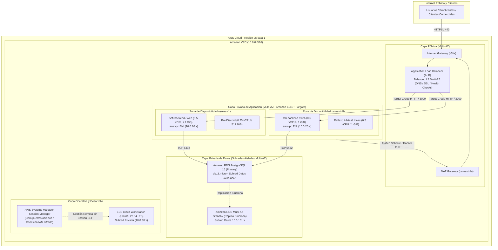
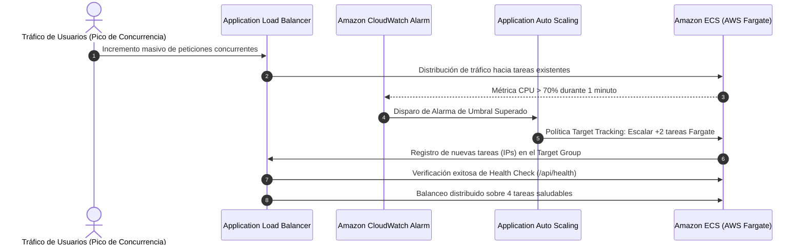
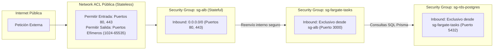
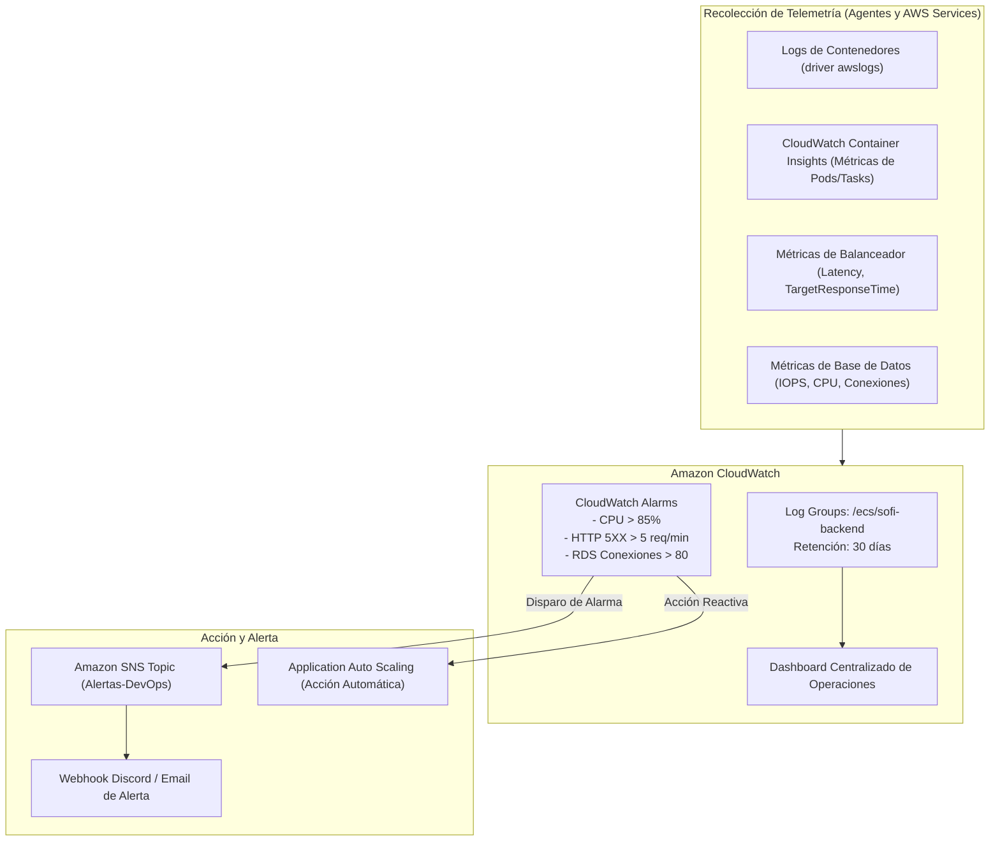

# SENATI - FORMACIÓN CONTINUA Y PRÁCTICA PROFESIONAL

## PROPUESTA DE PROYECTO: DISEÑO E IMPLEMENTACIÓN DE ARQUITECTURA CLOUD ESCALABLE, TOLERANTE A FALLOS Y DE ALTA DISPONIBILIDAD EN AWS PARA EL ÁREA DE DESARROLLO DE SOFTWARE

---

# ETAPA 3: Arquitecturas Escalables, Operaciones y Automatización

---

## 1. Arquitectura Dinámica, de Alta Disponibilidad y Tolerante a Fallos

El objetivo primordial de esta etapa es transformar los componentes desacoplados en las fases previas en una infraestructura dinámica capaz de absorber variaciones bruscas de tráfico, recuperarse de forma automática ante incidentes y garantizar una disponibilidad superior al 99.9% para **APM Inversiones EIRL**.



---

### 1.1 Balanceo Dinámico de Carga: Application Load Balancer (ALB)

Para distribuir de manera equitativa las peticiones HTTP/HTTPS entrantes y eliminar cualquier punto único de fallo (*Single Point of Failure - SPOF*), se implementa un **Application Load Balancer (ALB)** de Nivel 7:

1. **Despliegue Multi-AZ:** El ALB se asocia a dos subredes públicas distribuidas en distintas Zonas de Disponibilidad (`us-east-1a` y `us-east-1b`).
2. **Enrutamiento Inteligente por Dominio y Ruta:**
   - Regla 1 (SOFI Plataforma): `host: sofi.apm.edu.pe` $\rightarrow$ Enruta a `TargetGroup-SOFI-Fargate`.
   - Regla 2 (Clientes Comerciales): `host: reflexoperu.com` o `arteyideas.pe` $\rightarrow$ Enruta a `TargetGroup-Clientes-Fargate`.
   - Regla 3 (Redirección Forzosa): Todo tráfico en el puerto `80 (HTTP)` se redirige permanentemente con código `301` hacia el puerto `443 (HTTPS)`.
3. **Comprobaciones de Estado de Salud (*Health Checks*):**
   - **Ruta de verificación:** `/api/health` para `sofi-backend` y `/` para el frontend Next.js.
   - **Intervalo:** Cada 15 segundos.
   - **Umbral saludable (*Healthy threshold*):** 2 comprobaciones exitosas consecutivas.
   - **Umbral no saludable (*Unhealthy threshold*):** 2 fallos consecutivos. Si una tarea de Fargate se degrada o no responde, el ALB drena las conexiones activas (*Connection Draining*) en 30 segundos y deja de enviarle tráfico, mientras ECS provisiona una tarea de reemplazo limpia.

---

### 1.2 Elasticidad y Auto Scaling con Amazon ECS y AWS Fargate

A diferencia del escalado tradicional con máquinas virtuales EC2 (que requiere entre 3 y 5 minutos para aprovisionar el hipervisor, inicializar Ubuntu y descargar dependencias), **AWS Fargate** permite que el servicio escale horizontalmente agregando o destruyendo tareas de contenedor en **cuestión de segundos**.



#### 1.2.1 Configuración de Políticas de Escalado (Target Tracking Scaling)

Se configuran dos políticas de escalamiento automático para el servicio `sofi-backend-service` gestionadas por **AWS Application Auto Scaling**:

| Parámetro de Auto Scaling | Configuración de Producción | Justificación Técnica |
|:---|:---:|:---|
| **Capacidad Mínima (*Min Capacity*)** | 2 Tareas | Garantiza alta disponibilidad base distribuida en al menos dos AZs (`us-east-1a` y `us-east-1b`). |
| **Capacidad Deseada (*Desired Capacity*)** | 2 Tareas | Carga nominal prevista durante jornada regular de practicantes y colaboradores. |
| **Capacidad Máxima (*Max Capacity*)** | 6 Tareas | Límite superior de seguridad para absorber picos sin incurrir en desbordamiento presupuestario. |
| **Métrica Principal: Utilización de CPU** | `ECSServiceAverageCPUUtilization = 70%` | Si el promedio de CPU de las tareas supera el 70%, se instancian tareas adicionales. Si desciende, se desaprovisionan de forma progresiva. |
| **Métrica Secundaria: Concurrencia ALB** | `ALBRequestCountPerTarget = 1,000` | Si el volumen de solicitudes por tarea supera las 1,000 req/min, escala anticipadamente antes de saturar el hilo de Node.js. |
| **Periodo de Enfriamiento (*Scale-In Cooldown*)** | 300 segundos (5 min) | Evita el efecto de oscilación (*flapping* o *thrashing*), impidiendo la destrucción prematura de tareas ante fluctuaciones transitorias. |

---

## 2. Seguridad Avanzada de Red (AWS VPC y Protección en Capas)

La arquitectura de red adopta una estrategia de **Defensa en Profundidad (*Defense-in-Depth*)**, asegurando que ningún componente interno posea exposición innecesaria hacia la red pública.



---

### 2.1 Matriz de Grupos de Seguridad (Security Groups)

Los Security Groups operan como firewalls virtuales con estado (*stateful*). Cada capa de la arquitectura referencia exclusivamente el identificador del grupo de seguridad de la capa precedente:

| Nombre del Security Group | Dirección | Protocolo / Puerto | Origen / Destino | Propósito Técnico |
|:---|:---:|:---:|:---:|:---|
| `sg-alb-public` | Inbound | TCP / 80, 443 | `0.0.0.0/0` (Internet) | Recepción de tráfico web seguro de practicantes y clientes. |
| `sg-alb-public` | Outbound | TCP / 3000, 80 | `sg-fargate-tasks` | Reenvío de tráfico a los contenedores en subredes privadas. |
| `sg-fargate-tasks` | Inbound | TCP / 3000 | `sg-alb-public` | **Acceso restringido:** Ninguna IP externa puede conectarse directo a las tareas. |
| `sg-fargate-tasks` | Outbound | TCP / 5432 | `sg-rds-postgres` | Conexión del ORM Prisma a la base de datos relacional. |
| `sg-fargate-tasks` | Outbound | TCP / 443 | `0.0.0.0/0` (vía NAT) | Comunicación con APIs de AWS (ECR, CloudWatch, S3) y Discord Gateway. |
| `sg-rds-postgres` | Inbound | TCP / 5432 | `sg-fargate-tasks` | **Aislamiento total:** Solo el backend puede dialogar con PostgreSQL. |
| `sg-rds-postgres` | Outbound | Todo | `0.0.0.0/0` (Bloqueado) | La base de datos no tiene salida permitida a redes externas. |

---

### 2.2 Listas de Control de Acceso a la Red (Network ACLs)

Como segunda línea de defensa sin estado (*stateless*) a nivel de subred, las **NACLs** filtran el tráfico antes de que alcance las interfaces de red elásticas:

* **NACL de Subredes Públicas:** Permite el ingreso de tráfico HTTP (80) y HTTPS (443) y el egreso hacia puertos efímeros (`1024-65535`) para el retorno de respuestas a clientes web.
* **NACL de Subredes Privadas:** Bloquea explícitamente cualquier solicitud entrante no originada desde el bloque CIDR interno de la VPC (`10.0.0.0/16`), mitigando intentos de escaneo de puertos.

---

### 2.3 Acceso Seguro y Eliminación del Bastión SSH tradicional: AWS Systems Manager

Para la administración técnica de las instancias EC2 (Cloud Workstations de practicantes) y el mantenimiento operativo, **se descarta el uso del clásico servidor bastión con puerto SSH (22) expuesto a Internet**:

1. **Riesgos del Bastión Tradicional Eliminados:**
   - No hay necesidad de abrir el puerto 22 hacia Internet (eliminando ataques de fuerza bruta y escaneos de bots).
   - Se elimina la necesidad de distribuir, respaldar o rotar llaves privadas `.pem`.
   - Se evita el costo adicional de mantener una instancia EC2 pública dedicada únicamente como puente SSH.
2. **Implementación de AWS Systems Manager (SSM) Session Manager:**
   - La conexión se inicia a través del **Agente SSM (amazon-ssm-agent)** preinstalado en la imagen de Ubuntu.
   - El agente establece una conexión saliente TLS/HTTPS (puerto 443) cifrada hacia los endpoints de AWS Systems Manager.
   - El acceso es controlado de forma estricta mediante **políticas de IAM**, requiriendo autenticación multifactor (MFA).
   - **Auditoría completa:** Cada comando ingresado en la terminal interactiva se registra en **Amazon CloudWatch Logs** y **AWS CloudTrail**, garantizando trazabilidad de las acciones de los practicantes.

---

### 2.4 Gobierno de Identidades y Control de Acceso (AWS IAM): Humanos vs. Cómputo

Para evitar vulnerabilidades críticas y cumplir con la advertencia técnica del docente sobre la gestión de identidades, la arquitectura delimita con absoluta precisión la frontera entre **quién accede a la consola (personas)** y **qué permisos tienen los servicios para comunicarse entre sí (máquinas y contenedores)**.

```mermaid
flowchart TD
    subgraph IAM_MODEL["Modelo Integral de AWS Identity and Access Management (IAM)"]
        direction TB

        subgraph HUMAN_ID["1. Identidades Humanas (Personas)"]
            direction TB
            ROOT["Cuenta Root (MFA Físico Obligatorio)<br/>Prohibida para operaciones cotidianas; solo facturación"]
            USERS["Usuarios Individuales IAM (jhefry-dev, lead-arch)<br/>MFA Obligatorio | Cero llaves estáticas permanentes"]
            GRP_ADMIN["Grupo IAM: Admins-CloudOps<br/>Política: Acceso administrativo acotado + Control de IaC"]
            GRP_DEV["Grupo IAM: Developers-Practicantes<br/>Política: Acceso a EC2 Dev y Staging; Deny explícito a Prod"]
            USERS -->|Heredan permisos de| GRP_ADMIN
            USERS -->|Heredan permisos de| GRP_DEV
        end

        subgraph MACHINE_ID["2. Identidades de Cómputo (Servicios y Tareas)"]
            direction TB
            subgraph EC2_IAM["Para Instancias EC2 (Cloud Workstations)"]
                R_EC2["IAM Role: EC2-DevWorkstation-Role<br/>Permisos: AmazonSSMManagedInstanceCore, S3ReadLMS, EFSMount"]
                IP_EC2["EC2 Instance Profile<br/>(Contenedor que asocia el Rol a la VM)"]
                VM_EC2["Instancia EC2 Ubuntu Workstation"]
                R_EC2 --> IP_EC2 --> VM_EC2
            end

            subgraph ECS_IAM["Para Contenedores en AWS Fargate"]
                TER["ECS Task Execution Role<br/>(Usado por el plano de AWS Fargate)"]
                TER_POL["Permisos:<br/>- AmazonECSTaskExecutionRolePolicy (Pull ECR, Logs CloudWatch)<br/>- ssm:GetParameters (Inyección segura de variables de entorno)"]
                TR["ECS Task Role<br/>(Usado por el código NestJS / Next.js)"]
                TR_POL["Permisos:<br/>- s3:GetObject / PutObject (Bucket LMS)<br/>- ses:SendEmail (Notificaciones)"]
                FARGATE_CONTAINER["Contenedor en Ejecución (sofi-backend / web)"]

                TER --- TER_POL --> FARGATE_CONTAINER
                TR --- TR_POL --> FARGATE_CONTAINER
            end
        end
    end
```



---

#### 2.4.1 Desglose Pedagógico del Diagrama de IAM

Para comprender con total claridad cómo opera este modelo y evitar los errores comunes que se cometen al implementar seguridad en AWS, a continuación se detalla cada componente del diagrama:

##### 1. El Pilar de Identidades Humanas (Personas)
Este bloque gestiona exclusivamente a los colaboradores y practicantes de **APM Inversiones EIRL** que ingresan a la consola o interactúan mediante la terminal:

* **Cuenta Root (El Dueño Absoluto):** Es la cuenta creada con el correo corporativo inicial. Tiene privilegios irrestrictos sobre todos los recursos y facturación. **Regla de oro:** Se activa Autenticación Multifactor (MFA) física o mediante app autenticadora, se bloquea la creación de llaves de acceso (`Access Keys`) y se guarda bajo llave; nunca se utiliza para tareas de desarrollo o administración diaria.
* **Usuarios IAM Individuales (Identidad Nominal):** Cada desarrollador y practicante cuenta con su propio usuario nominal (ejemplo: `jhefry-dev`). Esto garantiza que cada acción quede firmada y registrada en los logs de auditoría de AWS CloudTrail, erradicando cuentas compartidas.
* **Grupos IAM y Principio de Menor Privilegio (PoLP):** 
  - **¿Por qué se usan grupos en lugar de dar permisos al usuario directo?** Si asignas permisos directamente a un usuario, cuando el equipo crezca o el practicante termine su ciclo, la gestión se vuelve inmanejable y propensa a fugas de privilegios. Las políticas de permisos se adjuntan **únicamente a los Grupos**. El usuario solo es un miembro que hereda dichos permisos.
  - **Grupo `Admins-CloudOps`:** Posee permisos para ejecutar plantillas de AWS CloudFormation, supervisar métricas y configurar balanceadores.
  - **Grupo `Developers-Practicantes`:** Solo puede conectarse mediante SSM a sus estaciones virtuales EC2 y realizar pruebas en el ambiente de Staging. Posee una regla explícita de denegación (`Deny`) sobre recursos etiquetados como `Environment: Production`, impidiendo que por error modifiquen la base de datos o los contenedores reales de la empresa.

---

##### 2. El Pilar de Identidades de Cómputo en EC2 (Instance Profile)
Este bloque resuelve cómo una máquina virtual física o virtualizada de EC2 puede interactuar con otros servicios de AWS de forma segura:

* **El Problema que Resuelve:** En arquitecturas inseguras, los desarrolladores suelen ejecutar `aws configure` dentro del servidor y guardar sus llaves privadas (`AWS_ACCESS_KEY_ID` y `SECRET`) en un archivo de texto en el disco de la máquina. Si el servidor es vulnerado, el atacante roba esas llaves y toma el control de toda la cuenta.
* **¿Qué es un IAM Role?** Es una identidad que no tiene contraseñas fijas; en su lugar, define un conjunto de permisos temporales y una política de confianza (*Trust Policy*) que autoriza a un servicio a utilizarlo.
* **¿Por qué hace falta un Instance Profile?** Una instancia EC2 es hardware/hipervisor; **no entiende directamente qué es un IAM Role**. Por ello, AWS introduce el **Instance Profile**: un puente o contenedor lógico que aloja el IAM Role y lo vincula con la tarjeta de red de la máquina virtual.
* **Cómo Funciona en la Práctica:** El sistema operativo Ubuntu consulta automáticamente a la dirección de metadatos interna (`http://169.254.169.254/latest/meta-data/iam/security-credentials/`). El *Instance Profile* le entrega credenciales temporales que rotan de forma automática cada 6 horas. Así, el agente de AWS Systems Manager y las utilidades de montaje de Amazon EFS operan con total transparencia sin una sola contraseña en el disco.

---

##### 3. El Pilar de Identidades en Contenedores Serverless (AWS Fargate: El Dual Role)
Al migrar de máquinas virtuales tradicionales a contenedores serverless con Fargate, **las instancias EC2 y los Instance Profiles desaparecen**. En Fargate no administras servidores; solo administras contenedores. Para mantener el aislamiento, AWS divide los permisos en **dos roles estrictamente separados**:

1. **ECS Task Execution Role (El Rol del Plano de Control de AWS):**
   * **¿Quién lo asume?** El motor de infraestructura de AWS Fargate / Amazon ECS **antes** de que el código de tu aplicación comience a ejecutarse.
   * **¿Qué permisos necesita?**
     - Descargar la imagen de contenedor privada desde **Amazon ECR** (`ecr:GetDownloadUrlForLayer`, `ecr:BatchGetImage`).
     - Crear los flujos de registros y enviar trazas hacia **Amazon CloudWatch Logs** (`logs:CreateLogStream`, `logs:PutLogEvents`).
     - Leer contraseñas de base de datos o llaves de API cifradas desde **AWS Systems Manager Parameter Store** o **AWS Secrets Manager** para inyectarlas de forma segura como variables de entorno al contenedor.
2. **ECS Task Role (El Rol de tu Aplicación en Ejecución):**
   * **¿Quién lo asume?** Tu código fuente (el proceso Node.js / NestJS de `sofi-backend` o `SOFI-WEB`) **mientras** está corriendo dentro del contenedor.
   * **¿Qué permisos necesita?**
     - Únicamente los servicios de AWS que tu lógica de negocio requiere. Por ejemplo, subir videos o PDFs al bucket de **Amazon S3** (`s3:PutObject`, `s3:GetObject`) o enviar correos mediante **Amazon SES**.
   * **¿Por qué es un error grave unificar ambos roles?**
     - Si le otorgas permisos de S3 al *Execution Role*, tu backend fallará al intentar comunicarse con S3 porque el código corre bajo el *Task Role*.
     - Y si le otorgas permisos de descarga de ECR o administración de logs al *Task Role*, estarías violando el principio de menor privilegio: un atacante que explote una vulnerabilidad web en la aplicación podría tener acceso a leer y modificar las imágenes Docker de la empresa en el repositorio ECR.

---

## 3. Monitoreo, Auditoría y Gestión de Recursos

El monitoreo proactivo asegura que cualquier degradación de rendimiento, fuga de memoria o anomalía de tráfico sea detectada y notificada antes de que impacte a los usuarios finales.



---

### 3.1 Métricas y Alarmas Configuradas en Amazon CloudWatch

Se definen alarmas críticas con notificación automática mediante **Amazon Simple Notification Service (SNS)**:

| Recurso | Métrica Supervisada | Condición de Alarma | Periodo / Evaluación | Impacto y Acción |
|:---|:---|:---:|:---:|:---|
| **ECS Fargate** | `CPUUtilization` | $\ge 85\%$ | 2 periodos de 1 min | Alerta por saturación crítica; escala tareas adicionales de respaldo. |
| **ECS Fargate** | `MemoryUtilization` | $\ge 80\%$ | 2 periodos de 1 min | Detección de posibles fugas de memoria en Node.js; reinicio preventivo de tareas. |
| **ALB** | `HTTPCode_Target_5XX_Count` | $> 5$ errores | 1 periodo de 1 min | Alarma inmediata de caída de backend; notificación vía SNS al canal DevOps. |
| **ALB** | `TargetResponseTime` | $> 1.5$ segundos | 3 periodos consecutivos | Degradación de latencia en peticiones de practicantes en el LMS. |
| **RDS PostgreSQL** | `FreeStorageSpace` | $< 5$ GB | 1 periodo de 5 min | Espacio libre bajo en disco; activación de *Storage Auto-Scaling*. |
| **RDS PostgreSQL** | `DatabaseConnections` | $> 85$ conexiones | 2 periodos de 1 min | Alerta de agotamiento de pool en Prisma ORM. |

---

### 3.2 Estrategia de Gobernanza, Control de Costos y Tagging

Para evitar desviaciones de presupuesto y garantizar la atribución exacta de cada gasto en la nube, se estandariza una **Política de Etiquetado Obligatorio (*Mandatory Resource Tagging*)**:

#### 3.2.1 Esquema de Etiquetas Estandarizado

```yaml
Tags:
  Project: "SOFI-Ecosistema"
  Environment: "Production"     # Valores: Production | Staging | Development
  Owner: "APM-Inversiones"
  CostCenter: "CC-TI-101"
  ManagedBy: "CloudFormation"
  Compliance: "SENATI-Final"
```

#### 3.2.2 Herramientas de Control Financiero (FinOps)
1. **AWS Budgets:** Configuración de un presupuesto mensual límite de **$60.00 USD** con alertas escalonadas:
   - Notificación al **80% ($48 USD)** del gasto previsto.
   - Notificación al **100% ($60 USD)** con advertencia directa al correo del líder técnico.
2. **AWS Trusted Advisor:** Supervisión periódica de los 5 pilares:
   - **Optimización de Costos:** Identificación de volúmenes EBS huérfanos o balanceadores sin tráfico.
   - **Seguridad:** Verificación de buckets de S3 con acceso público accidental y comprobación de MFA en usuarios IAM.
   - **Tolerancia a Fallos:** Verificación de respaldos automáticos en RDS y comprobación de distribución Multi-AZ.

---

## 4. Automatización e Infraestructura como Código (IaC)

Para cumplir con el estándar industrial de despliegues repetibles, auditables y libres de error manual, la arquitectura completa de la Etapa 3 se formaliza mediante una plantilla declarativa de **AWS CloudFormation**.

### 4.1 Arquitectura de la Plantilla CloudFormation

La plantilla aprovisiona de manera coordinada:
1. El clúster de **Amazon ECS**.
2. Las definiciones de tareas (**Task Definitions**) en Fargate con especificación granular de recursos.
3. El balanceador de carga **ALB**, sus *Target Groups* y reglas de listener.
4. El servicio **ECS Service** vinculado al balanceador.
5. Las políticas de **Application Auto Scaling** basadas en métricas de CPU.
6. Las alarmas de **Amazon CloudWatch**.

---

### 4.2 Código de la Plantilla: `template-etapa3.yaml`

```yaml
AWSTemplateFormatVersion: '2010-09-09'
Description: 'APM Inversiones EIRL - Infraestructura Escalable y Automatizada en AWS (ECS Fargate + ALB + Auto Scaling)'

Parameters:
  VpcId:
    Type: AWS::EC2::VPC::Id
    Description: 'ID de la VPC principal creada en la Fase 1'
  PublicSubnetA:
    Type: AWS::EC2::Subnet::Id
    Description: 'Subred publica en us-east-1a para el ALB'
  PublicSubnetB:
    Type: AWS::EC2::Subnet::Id
    Description: 'Subred publica en us-east-1b para el ALB'
  PrivateSubnetA:
    Type: AWS::EC2::Subnet::Id
    Description: 'Subred privada en us-east-1a para tareas Fargate'
  PrivateSubnetB:
    Type: AWS::EC2::Subnet::Id
    Description: 'Subred privada en us-east-1b para tareas Fargate'
  ContainerImage:
    Type: String
    Default: 'public.ecr.aws/docker/library/node:20-alpine'
    Description: 'URI de la imagen de contenedor en ECR'

Resources:
  # ==========================================================
  # 1. SEGURIDAD Y GRUPOS DE SEGURIDAD (SECURITY GROUPS)
  # ==========================================================
  AlbSecurityGroup:
    Type: AWS::EC2::SecurityGroup
    Properties:
      GroupDescription: 'Acceso publico HTTP y HTTPS hacia el ALB'
      VpcId: !Ref VpcId
      SecurityGroupIngress:
        - IpProtocol: tcp
          FromPort: 80
          ToPort: 80
          CidrIp: 0.0.0.0/0
        - IpProtocol: tcp
          FromPort: 443
          ToPort: 443
          CidrIp: 0.0.0.0/0
      Tags:
        - Key: Name
          Value: sg-sofi-alb-public

  FargateSecurityGroup:
    Type: AWS::EC2::SecurityGroup
    Properties:
      GroupDescription: 'Trafico entrante exclusivo desde el ALB hacia las tareas Fargate'
      VpcId: !Ref VpcId
      SecurityGroupIngress:
        - IpProtocol: tcp
          FromPort: 3000
          ToPort: 3000
          SourceSecurityGroupId: !Ref AlbSecurityGroup
      Tags:
        - Key: Name
          Value: sg-sofi-fargate-tasks

  # ==========================================================
  # 2. APPLICATION LOAD BALANCER Y TARGET GROUPS
  # ==========================================================
  ApplicationLoadBalancer:
    Type: AWS::ElasticLoadBalancingV2::LoadBalancer
    Properties:
      Name: alb-sofi-production
      Scheme: internet-facing
      Type: application
      Subnets:
        - !Ref PublicSubnetA
        - !Ref PublicSubnetB
      SecurityGroups:
        - !Ref AlbSecurityGroup
      Tags:
        - Key: Environment
          Value: Production

  AlbTargetGroup:
    Type: AWS::ElasticLoadBalancingV2::TargetGroup
    Properties:
      Name: tg-sofi-backend
      Port: 3000
      Protocol: HTTP
      TargetType: ip
      VpcId: !Ref VpcId
      HealthCheckPath: /api/health
      HealthCheckIntervalSeconds: 15
      HealthyThresholdCount: 2
      UnhealthyThresholdCount: 2
      Matcher:
        HttpCode: '200'
      TargetGroupAttributes:
        - Key: deregistration_delay.timeout_seconds
          Value: '30'

  AlbListenerHTTP:
    Type: AWS::ElasticLoadBalancingV2::Listener
    Properties:
      LoadBalancerArn: !Ref ApplicationLoadBalancer
      Port: 80
      Protocol: HTTP
      DefaultActions:
        - Type: forward
          TargetGroupArn: !Ref AlbTargetGroup

  # ==========================================================
  # 3. CLÚSTER DE AMAZON ECS Y TAREAS FARGATE
  # ==========================================================
  EcsCluster:
    Type: AWS::ECS::Cluster
    Properties:
      ClusterName: cluster-apm-sofi-prod
      ClusterSettings:
        - Name: containerInsights
          Value: enabled
      Tags:
        - Key: Environment
          Value: Production

  EcsTaskExecutionRole:
    Type: AWS::IAM::Role
    Properties:
      RoleName: role-sofi-ecs-task-execution
      AssumeRolePolicyDocument:
        Version: '2012-10-17'
        Statement:
          - Effect: Allow
            Principal:
              Service: ecs-tasks.amazonaws.com
            Action: sts:AssumeRole
      ManagedPolicyArns:
        - arn:aws:iam::aws:policy/service-role/AmazonECSTaskExecutionRolePolicy

  EcsTaskRole:
    Type: AWS::IAM::Role
    Properties:
      RoleName: role-sofi-ecs-task-code
      AssumeRolePolicyDocument:
        Version: '2012-10-17'
        Statement:
          - Effect: Allow
            Principal:
              Service: ecs-tasks.amazonaws.com
            Action: sts:AssumeRole
      Policies:
        - PolicyName: S3AccessPolicy
          PolicyDocument:
            Version: '2012-10-17'
            Statement:
              - Effect: Allow
                Action:
                  - s3:GetObject
                  - s3:PutObject
                Resource: 'arn:aws:s3:::apm-sofi-lms-media/*'

  SofiTaskDefinition:
    Type: AWS::ECS::TaskDefinition
    Properties:
      Family: td-sofi-backend
      NetworkMode: awsvpc
      RequiresCompatibilities:
        - FARGATE
      Cpu: '512'       # 0.50 vCPU
      Memory: '1024'   # 1024 MiB RAM
      ExecutionRoleArn: !GetAtt EcsTaskExecutionRole.Arn
      TaskRoleArn: !GetAtt EcsTaskRole.Arn
      ContainerDefinitions:
        - Name: sofi-backend-container
          Image: !Ref ContainerImage
          Essential: true
          PortMappings:
            - ContainerPort: 3000
              Protocol: tcp
          LogConfiguration:
            LogDriver: awslogs
            Options:
              awslogs-group: /ecs/sofi-backend
              awslogs-region: !Ref 'AWS::Region'
              awslogs-stream-prefix: ecs

  # ==========================================================
  # 4. SERVICIO ECS VINCULADO AL BALANCEADOR
  # ==========================================================
  EcsService:
    Type: AWS::ECS::Service
    DependsOn: AlbListenerHTTP
    Properties:
      ServiceName: srv-sofi-backend
      Cluster: !Ref EcsCluster
      TaskDefinition: !Ref SofiTaskDefinition
      LaunchType: FARGATE
      DesiredCount: 2
      DeploymentConfiguration:
        MaximumPercent: 200
        MinimumHealthyPercent: 100
      NetworkConfiguration:
        AwsvpcConfiguration:
          AssignPublicIp: DISABLED
          Subnets:
            - !Ref PrivateSubnetA
            - !Ref PrivateSubnetB
          SecurityGroups:
            - !Ref FargateSecurityGroup
      LoadBalancers:
        - ContainerName: sofi-backend-container
          ContainerPort: 3000
          TargetGroupArn: !Ref AlbTargetGroup

  # ==========================================================
  # 5. AUTO SCALING DE TAREAS FARGATE
  # ==========================================================
  ScalableTarget:
    Type: AWS::ApplicationAutoScaling::ScalableTarget
    Properties:
      MaxCapacity: 6
      MinCapacity: 2
      ResourceId: !Sub 'service/${EcsCluster}/${EcsService.Name}'
      RoleARN: !Sub 'arn:aws:iam::${AWS::AccountId}:role/aws-service-role/ecs.application-autoscaling.amazonaws.com/AWSServiceRoleForApplicationAutoScaling_ECSService'
      ScalableDimension: ecs:service:DesiredCount
      ServiceNamespace: ecs

  CpuScalingPolicy:
    Type: AWS::ApplicationAutoScaling::ScalingPolicy
    Properties:
      PolicyName: SofiTargetTrackingCpuPolicy
      PolicyType: TargetTrackingScaling
      ScalingTargetId: !Ref ScalableTarget
      TargetTrackingScalingPolicyConfiguration:
        PredefinedMetricSpecification:
          PredefinedMetricType: ECSServiceAverageCPUUtilization
        TargetValue: 70.0
        ScaleInCooldown: 300
        ScaleOutCooldown: 60

Outputs:
  LoadBalancerDNS:
    Description: 'Nombre DNS publico del Application Load Balancer'
    Value: !GetAtt ApplicationLoadBalancer.DNSName
  EcsClusterName:
    Description: 'Nombre del Cluster ECS'
    Value: !Ref EcsCluster
```

---

## 5. Cuadro Consolidado Final de la Arquitectura Completa (Fases 1, 2 y 3)

| Capa Arquitectónica | Componentes y Servicios AWS | Configuración Específica | Mecanismo de Resiliencia y Alta Disponibilidad |
|:---|:---|:---|:---|
| **Perímetro y DNS** | Amazon Route 53 + AWS Certificate Manager (ACM) | Registros Alias con enrutamiento de baja latencia; certificados SSL/TLS automáticos. | Red Global Anycast distribuida mundialmente. |
| **Balanceo de Carga** | Application Load Balancer (ALB) | Balanceo Nivel 7 en subredes públicas; Health Checks periódicos cada 15s. | Multi-AZ nativo con drenado automático de conexiones defectuosas. |
| **Cómputo Serverless** | Amazon ECS sobre AWS Fargate | Contenedores `sofi-backend` (0.5 vCPU / 1 GiB), Web y Bot en modo `awsvpc`. | Multi-AZ (desplegado en `us-east-1a` y `us-east-1b`) con autorecuperación instantánea. |
| **Elasticidad Dinámica** | AWS Application Auto Scaling | Target Tracking (70% CPU, 1,000 req/min); Mínimo: 2, Máximo: 6 tareas. | Escalamiento horizontal en segundos ante picos de demanda. |
| **Cómputo de Prácticas** | Amazon EC2 (`t3.small` / `t3.medium`) | Ubuntu 22.04 LTS con 25 GB EBS `gp3` + Amazon EFS montado. | Apagado programado fuera de jornada; acceso sin puertos abiertos vía SSM. |
| **Base de Datos** | Amazon RDS for PostgreSQL 16 | Instancia `db.t3.micro` con réplica Multi-AZ síncrona en subred privada. | Failover automático de DNS transparente ante fallas en menos de 60 segundos. |
| **Almacenamiento** | Amazon S3 + S3 Glacier + Amazon EFS | S3 Standard con ciclo de vida hacia Glacier a los 90 días; EFS Multi-AZ para Devs. | 99.999999999% (11 nueves) de durabilidad de datos. |
| **Seguridad e IAM** | AWS IAM + Security Groups en capas | Grupos con PoLP; separación de Instance Profile (EC2) y Task Execution / Task Roles (ECS). | Cero llaves estáticas; micro-segmentación de red estricta. |
| **Monitoreo y Alertas** | Amazon CloudWatch + Container Insights + SNS | Logs centralizados en `/ecs/sofi-backend`; alarmas de CPU, 5XX y conexiones RDS. | Alerta inmediata multicanal ante anomalías operativas. |
| **Infraestructura como Código**| AWS CloudFormation | Plantilla YAML declarativa para aprovisionamiento repetible y versionado. | Entornos de desarrollo, prueba y producción 100% estandarizados y auditables. |

---

## 6. Conclusiones Generales del Proyecto Integrador

1. **Cumplimiento Integral de Objetivos:** Se diseñó e implementó una arquitectura en la nube de nivel empresarial que erradica las limitaciones diagnosticadas en la Fase 1 (servidor físico único, caídas imprevistas del bot y competencia desleal de recursos).
2. **Modernización Tecnológica de Alto Impacto:** La adopción de **Amazon ECS con AWS Fargate** sitúa a **APM Inversiones EIRL** en el paradigma moderno de contenedores serverless, liberando al equipo técnico de la pesada carga de mantenimiento de sistemas operativos y entregando un escalamiento elástico en segundos.
3. **Gobierno y Seguridad sin Concesiones:** La segregación estricta de identidades humanas y roles de cómputo en **AWS IAM**, combinada con la eliminación de puertos SSH mediante **AWS Systems Manager**, garantiza un entorno formativo seguro donde los practicantes pueden experimentar y aprender sin vulnerar la integridad de los datos productivos.
4. **Viabilidad Económica Comprobada (FinOps):** La arquitectura equilibra alta disponibilidad y eficiencia presupuestal, operando dentro del rango estimado de **$55 a $60 USD mensuales**, optimizado mediante apagados programados, políticas de ciclo de vida en S3 y elasticidad bajo demanda.
