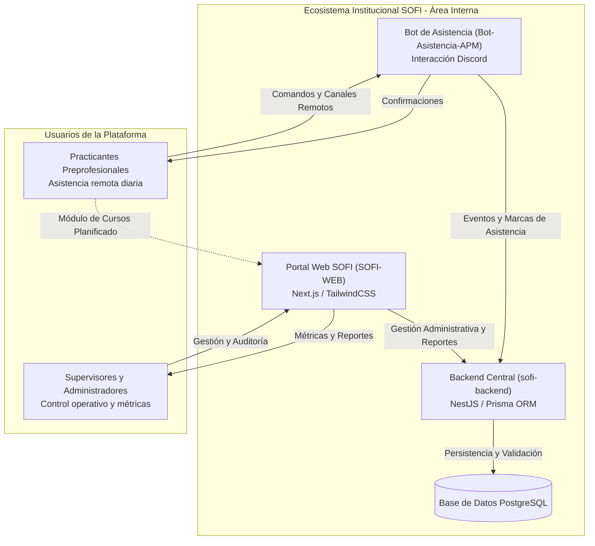
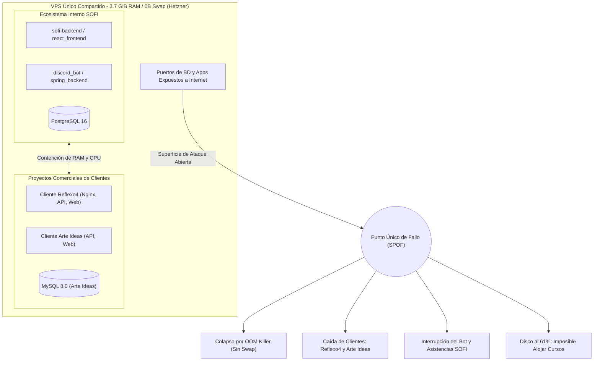
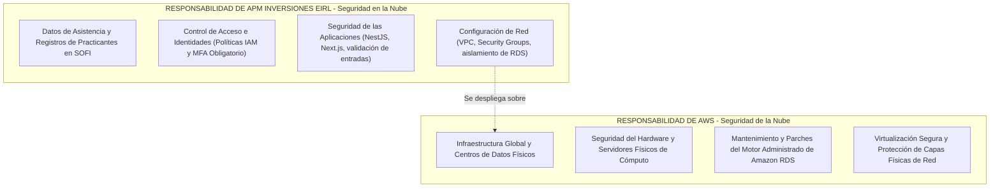
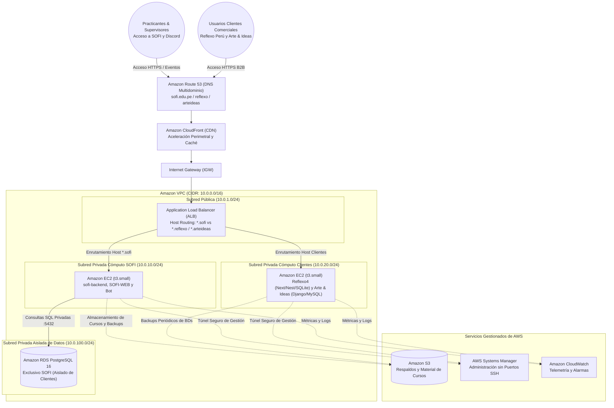

# SENATI - FORMACIÓN CONTINUA Y PRÁCTICA PROFESIONAL
## PROPUESTA DE PROYECTO: DISEÑO E IMPLEMENTACIÓN DE ARQUITECTURA CLOUD ESCALABLE, TOLERANTE A FALLOS Y DE ALTA DISPONIBILIDAD EN AWS PARA EL ÁREA DE DESARROLLO DE SOFTWARE

---

# ETAPA 1: Diagnóstico de la Empresa y Fundamentos Cloud

---

## 1. Descripción de la Empresa de Formación Práctica

### 1.1 Naturaleza de la Empresa, Sector y Modelo de Negocio

La organización donde se desarrolla la formación práctica es **APM Inversiones EIRL**, una empresa de servicios tecnológicos perteneciente al sector de **Tecnologías de la Información (TI) y Desarrollo de Software**, orientada al desarrollo web, arquitectura de sistemas y gestión de talento técnico.

El modelo de negocio global de la empresa opera bajo una modalidad **B2B (Business-to-Business)** sustentada en dos líneas comerciales principales:

1. **Desarrollo de Sitios Web Corporativos e Informativos (Ingreso por Proyecto):**
   - Diseño, programación y puesta en producción de portales institucionales, catálogos digitales interactivos y *landing pages* para pymes, clínicas y comercios.
   - Cobro por proyecto mediante hitos de desarrollo e integración técnica.

2. **Hosting y Mantenimiento Cloud Gestionado (Ingreso Recurrente - MRR):**
   - Servicio periódico de alojamiento, soporte preventivo, renovación de certificados SSL/TLS y copias de seguridad de las plataformas desplegadas.
   - Generación de ingresos recurrentes periódicos (*Monthly Recurring Revenue - MRR*), aportando estabilidad financiera a la organización.

---

### 1.2 Identificación y Descripción del Área de Desarrollo de Soluciones de TI

Dentro del departamento de TI de APM Inversiones EIRL existe una división funcional clara entre dos áreas de trabajo:

1. **Área de Proyectos Comerciales (Externa):** Equipo encargado de la maquetación, programación y entrega de los sitios web de los clientes finales. Aunque se conoce su existencia operativa dentro de la organización, el practicante no tiene acceso ni opera directamente sobre dichos repositorios o servidores de producción.
2. **Área de Desarrollo y Plataformas Internas (Área de Formación Práctica del Estudiante):** Unidad técnica en la que el practicante desempeña sus funciones. Tiene a su cargo el diseño, desarrollo, soporte y evolución del ecosistema de software institucional de la empresa, denominado **Plataforma SOFI**.

#### Componentes del Ecosistema SOFI:

El flujo de trabajo técnico del área interna gira en torno a tres módulos interconectados:

* **Backend Central (`sofi-backend`):**
  - Desarrollado sobre el framework **NestJS** con **TypeScript**, estructurado bajo una arquitectura modular desacoplada.
  - Utiliza el ORM **Prisma** para la gestión de modelos y comunicación fluida con la base de datos relacional PostgreSQL.
  - Provee las APIs REST y endpoints de WebSockets necesarios para procesar las transacciones de asistencia, reglas de negocio, métricas operativas y autenticación de usuarios.

* **Frontend Web Institucional (`SOFI-WEB`):**
  - Aplicación web desarrollada con **Next.js** (React) y estilos con **TailwindCSS**.
  - **Estado actual (Panel Administrativo):** Proporciona una interfaz para que los líderes técnicos y administradores visualicen en tiempo real la asistencia de los practicantes, generen reportes y supervisen el cumplimiento de actividades.
  - **Evolución planificada (Módulo de Cursos y Capacitaciones LMS):** En su ciclo de desarrollo actual se proyecta incorporar un módulo formativo. A través de este portal, los practicantes accederán a guías técnicas, manuales de procesos, cursos estructurados y evaluaciones durante su estancia formativa en la empresa.

* **Bot de Asistencia (`Bot-Asistencia-APM`):**
  - Servicio automatizado integrado con la API de Discord que actúa como la interfaz diaria de comunicación para los practicantes.
  - Permite el registro de jornada (ingreso, pausas y salida), justificaciones y notificaciones operativas directamente desde los canales de trabajo remoto.
  - Transmite cada evento hacia `sofi-backend` para su validación y persistencia centralizada.

#### Flujo Operativo Interno:
1. El practicante remoto se conecta a los canales de la empresa e interactúa con `Bot-Asistencia-APM`.
2. El bot valida la identidad del practicante y despacha la petición al servicio `sofi-backend`.
3. El backend ejecuta las reglas de negocio, valida los horarios y registra la marca en la base de datos PostgreSQL.
4. Los supervisores acceden a `SOFI-WEB` para auditar el tablero de asistencia y el rendimiento del equipo.
5. Al habilitarse el módulo de capacitación en `SOFI-WEB`, los practicantes accederán directamente al portal web para consultar materiales de inducción y cursos técnicos.

---

## 2. Análisis de la Infraestructura y Tecnología Actual

### 2.1 Descripción Tecnológica y Telemetría Real del Servidor

Toda la operación de la empresa reside actualmente en un único **Servidor Virtual Privado (VPS)** en la nube (Hetzner), compartiendo la totalidad de los recursos de la máquina sin aislamiento físico, de red ni de procesos:

* **Sistema Operativo y Plataforma:** Servidor Linux bajo distribución **Ubuntu 22.04.5 LTS (Jammy Jellyfish)** con Kernel `5.15.0-185-generic x86_64`.
* **Capacidad de Cómputo:** **3 vCPUs** sustentadas sobre un procesador **AMD EPYC-Rome** a nivel de hipervisor.
* **Memoria RAM y Riesgo de Memoria Virtual:** Cuenta con **3.7 GiB de memoria RAM física**. La telemetría operativa revela un consumo sostenido de **2.1 GiB (cerca del 60%)**, dejando un margen disponible de apenas **1.4 GiB**. El sistema carece por completo de memoria de intercambio (**Swap: 0 B**), lo que implica que ante cualquier incremento de concurrencia o saturación de consultas, el kernel activa de inmediato el mecanismo *Out of Memory Killer (OOM Killer)*, abortando procesos críticos de manera forzada e impredecible.
* **Almacenamiento Local en Disco:** Unidad de estado sólido de **75 GB** (`/dev/sda1`), de la cual **44 GB ya se encuentran ocupados (61% de utilización)**, dejando una disponibilidad reducida de solo 29 GB.
* **Capa de Contenedores y Cargas Activas Simultáneas:** Docker Engine ejecuta simultáneamente 11 contenedores sobre el mismo host, correspondientes a dos frentes totalmente dispares:
  - **Cargas del Ecosistema Interno SOFI y Asistencia:**
    * `sofi-backend`: Servicio central en NestJS con TypeScript y Prisma.
    * `discord_bot`: Proceso en segundo plano para la interacción con los practicantes en Discord.
    * `spring_backend`: Servicio backend auxiliar de asistencia técnica.
    * `react_frontend`: Interfaz de usuario para la interacción de asistencia.
    * `postgres_db`: Instancia del motor relacional **PostgreSQL 16 (Alpine)** para los registros de jornadas y datos de SOFI.
  - **Cargas de Proyectos Comerciales de Clientes Externos:**
    * **Proyecto Cliente Reflexo4:** Pila compuesta por tres contenedores (`reflexo4-nginx-1`, `reflexo4-backend-1` y `reflexo4-frontend-1`).
    * **Proyecto Cliente Arte Ideas:** Pila compuesta por `arteideas-backend`, `arteideas-frontend` y un segundo motor de base de datos relacional independiente, **MySQL 8.0** (`arteideas-db`), compitiendo directamente por memoria y disco contra PostgreSQL.
* **Control de Versiones y Gestión de Código:** Repositorios alojados en **GitHub** con control distribuido mediante **Git**, implementando ramas de trabajo para despliegues.

---

### 2.2 Modalidad de Trabajo

La modalidad de trabajo para el equipo de desarrollo y los practicantes es **100% remota**.

Esta condición implica una dependencia operativa constante de la infraestructura:
* La asistencia y coordinación técnica de los practicantes depende de la disponibilidad ininterrumpida del bot de Discord y el backend.
* Las actividades de administración, supervisión y despliegue se ejecutan a través de Internet hacia el servidor central.

---

### 2.3 Identificación de Limitaciones Actuales (Enfoque Crítico)

La concentración de servicios comerciales y herramientas internas en un único VPS genera riesgos operacionales críticos:

1. **Punto Único de Fallo (SPOF) y Colisión Extrema de Cargas:**
   - La convivencia de dos motores relacionales pesados (**PostgreSQL 16** y **MySQL 8.0**) junto a múltiples APIs y frontends en una máquina de 3.7 GiB de RAM elimina todo aislamiento de fallas.
   - Una consulta compleja o un reporte en cualquiera de las bases de datos satura la memoria compartida, arriesgando la caída inmediata de los sitios de clientes comerciales (**Reflexo4** y **Arte Ideas**) o la desconexión del bot de asistencia de los practicantes.

2. **Carencia de Memoria Swap y Riesgo Inminente de Caída por OOM:**
   - Al no existir archivo ni partición Swap, el sistema operativo carece de amortiguador frente a picos de consumo. En cuanto la memoria llega al umbral límite, el sistema operativo termina procesos en ejecución de forma aleatoria para evitar el pánico de kernel.

3. **Agotamiento de Almacenamiento y Bloqueo del Módulo de Cursos:**
   - Con **44 GB ocupados (61%)** de los 75 GB disponibles, el servidor solo dispone de 29 GB libres. Alojar y servir material multimedia educativo (videos instructivos, manuales en PDF y recursos interactivos) para las capacitaciones de los practicantes provocaría la saturación del disco raíz, paralizando las bases de datos por falta de espacio para escrituras y logs.

4. **Brechas de Seguridad Críticas por Exposición Perimetral:**
   - **Puertos Expuestos Directamente a Internet:** Se verifica que **múltiples puertos de servicios y bases de datos se encuentran expuestos directamente a Internet** sin restricción de origen ni filtrado perimetral. Los motores de datos (PostgreSQL y MySQL) y los servicios de backend reciben conexiones públicas sin una pasarela de protección perimetral, dejando el servidor al alcance de escaneos y ataques continuos de fuerza bruta.
   - **Ausencia de Segmentación de Red:** Las aplicaciones comerciales y las herramientas internas comparten la misma red virtual de Docker en el host, permitiendo el movimiento lateral en caso de que un contenedor sea comprometido.

5. **Costos Ocultos y Sobrecarga de Mantenimiento:**
   - El tiempo de los desarrolladores y líderes se consume en tareas de administración manual (mantenimiento de contenedores, revisión manual de logs y respaldos locales), restando horas efectivas a la evolución de SOFI y la formación de practicantes.

---

## 3. Propuesta Conceptual basada en Fundamentos AWS (Cloud Foundations)

La adopción de Amazon Web Services (AWS) proporciona una arquitectura modular, elástica y segura que desacopla la persistencia de datos, aísla los entornos y prepara la plataforma para su crecimiento.

---

### 3.1 Justificación de Migración y Adopción Cloud mediante AWS CAF

Se aplica el marco **AWS Cloud Adoption Framework (AWS CAF)** para guiar la transformación tecnológica:

| Perspectiva CAF | Diagnóstico Actual en VPS | Transformación con AWS |
| :--- | :--- | :--- |
| **Negocio (Business)** | Riesgo de caídas del bot de asistencia y sitios comerciales por competencia de recursos. | Continuidad operativa respaldada por acuerdos de nivel de servicio (SLA); habilitación del módulo de cursos para capacitar talento técnico. |
| **Personas (People)** | Practicantes y desarrolladores lidian con caídas imprevistas y mantenimiento manual. | Adopción de buenas prácticas de ingeniería en la nube; entorno formativo profesional y estandarizado. |
| **Gobernanza (Governance)** | Imposibilidad de medir y atribuir costos entre la plataforma interna SOFI y los proyectos comerciales. | Visibilidad detallada con **AWS Cost Explorer**, presupuestos de control con **AWS Budgets** y etiquetado por proyecto. |
| **Plataforma (Platform)** | Servidor monolítico rígido de 4 GB de RAM sin capacidad de escalamiento dinámico. | Desacoplamiento de componentes: persistencia en **Amazon RDS**, distribución de material formativo en **Amazon S3** y cómputo elástico en **Amazon EC2**. |
| **Seguridad (Security)** | Múltiples puertos expuestos a Internet sin firewalls perimetrales ni roles de menor privilegio. | Segmentación por capas en **Amazon VPC**, eliminación de accesos directos desprotegidos y gobierno de identidades con **AWS IAM**. |
| **Operaciones (Operations)** | Diagnóstico manual mediante comandos directos y respaldos locales en el mismo disco. | Monitoreo centralizado con **Amazon CloudWatch**, respaldos automáticos e inmutables, y gestión desatendida vía **AWS Systems Manager**. |

---

### 3.2 Estimación Económica Inicial (Pricing y TCO)

#### 3.2.1 Enfoque TCO: Aislamiento y Resiliencia vs. Costo Oculto

El análisis de Costo Total de Propiedad (TCO) revela que el ahorro aparente de un VPS compartido se pierde rápidamente ante las horas-hombre dedicadas a recuperar caídas del servidor y el riesgo de pérdida de datos. 

La arquitectura inicial en AWS traslada la inversión hacia un esquema de alta disponibilidad que independiza la base de datos y provee almacenamiento elástico sin costos fijos sobredimensionados:

#### 3.2.2 Estimación Mensual de la Arquitectura Base (AWS Pricing Calculator)

Las tarifas han sido calculadas y verificadas oficialmente en la herramienta **AWS Pricing Calculator** para la región de referencia **US East (N. Virginia)** (`us-east-1`), garantizando reproducibilidad paso a paso sin sobrecostos ocultos ni aprovisionamientos redundantes:

| # | Servicio AWS | Tipo / Configuración Exacta | Propósito Técnico | Costo Mensual Oficial |
| :-: | :--- | :--- | :--- | :---: |
| 1 | **Amazon EC2 (SOFI)** | `t3.small` (2 vCPU, 2 GiB RAM) Linux, On-Demand (730 h continuas) | Cómputo desacoplado de `sofi-backend`, `SOFI-WEB` y bot de Discord. | **$15.18 USD** |
| 2 | **Amazon EC2 (Clientes)** | `t3.small` (2 vCPU, 2 GiB RAM) Linux, On-Demand (730 h continuas) | Cómputo aislado para Reflexo Perú (Next/Nest/SQLite) y Arte & Ideas (Django/MySQL). | **$15.18 USD** |
| 3 | **Amazon EBS (x2)** | 2x 30 GB `gp3` (SSD Uso General) 3,000 IOPS y 125 MB/s base incluidos | Almacenamiento persistente de SO Linux y contenedores para ambas instancias. | **$4.80 USD** |
| 4 | **Amazon RDS for PostgreSQL** | `db.t3.micro` Single-AZ ($13.14) 20 GB almacenamiento `gp3` ($2.30) | Base de datos relacional administrada, exclusiva y aislada para SOFI. | **$15.44 USD** |
| 5 | **Amazon S3** | S3 Standard: 15 GB almacenamiento 1,000 peticiones PUT + 10,000 GET | Repositorio elástico para materiales del LMS (videos/PDFs) y respaldos históricos. | **$0.35 USD** |
| 6 | **AWS Systems Manager** | SSM Session Manager estándar 10 parámetros en Parameter Store | Administración remota cifrada por túnel IAM sin requerir apertura del puerto SSH (22). | **$0.00 USD** |
| 7 | **Amazon CloudWatch** | 2 Alarmas de salud/CPU ($0.20) 2 GB Logs ingeridos y 1 mes retención | Monitoreo de disponibilidad del backend y alerta inmediata ante caídas del bot. | **$1.21 USD** |
| 8 | **Amazon Route 53** | 1 Hosted Zone pública (Consultas estándar dentro de cuota) | Resolución DNS de subdominios institucionales (`sofi`) y comerciales (`reflexo`, `arteideas`). | **$0.50 USD** |
| 9 | **Data Transfer (DTO)** | 11 GB de tráfico de salida a Internet (Tráfico entrante e intra-AZ a $0.00) | Ancho de banda saliente hacia practicantes remotos y clientes comerciales. | **$0.99 USD** |
| | **TOTAL MENSUAL VERIFICADO** | | **Inversión mensual base consolidada en AWS (SOFI + Clientes)** | **`$53.65 USD`** |

> **Criterios Clave de Optimización Financiera:**
> 1. **Uso de volúmenes de última generación (`gp3`):** Tanto en EBS como en RDS se seleccionó almacenamiento `gp3` en lugar del antiguo `gp2`, obteniendo un rendimiento superior (3,000 IOPS garantizados sin depender de ráfagas) y un ahorro directo de hasta 20% por GB.
> 2. **Eliminación de trampas de sobrecosto en RDS:** Se prescindió de *RDS Proxy* (ahorro de $21.90 USD/mes) al manejarse el pool de conexiones eficientemente desde Prisma/NestJS, y de *Database Insights* (ahorro de $18.25 USD/mes) por no requerirse telemetría avanzada de kernel para esta escala. Asimismo, al usar PostgreSQL 16 no aplica tarifa de *Extended Support*.
> 3. **Aprovechamiento de cuotas y retenciones gratuitas:** Las copias de seguridad automáticas de RDS están incluidas sin costo adicional hasta el 100% del tamaño de la base de datos (20 GB a $0.00). Systems Manager es un servicio nativo gratuito para instancias EC2, y Parameter Store no genera cobros para sus primeros 10,000 parámetros estándar.
> 4. **Optimización Operativa Futura:** Se contempla la implementación de **AWS Instance Scheduler** para suspender únicamente la instancia EC2 de SOFI fuera del horario de prácticas (noches y fines de semana), reduciendo el costo de cómputo formativo en un **60%** (~$9.00 USD de ahorro), situando la factura consolidada en apenas **~$44.00 USD/mes** manteniendo los sistemas de clientes comerciales en línea 24/7.

---

### 3.3 Modelo de Seguridad y Gobierno Inicial

#### 3.3.1 Modelo de Responsabilidad Compartida de AWS

* **AWS es responsable de la seguridad "DE" la nube:** Protección física de las instalaciones, mantenimiento de los hipervisores y aplicación de actualizaciones del motor administrado de Amazon RDS.
* **APM Inversiones EIRL es responsable de la seguridad "EN" la nube:** Configuración de Security Groups, gestión de identidades y accesos en IAM, protección de datos y despliegue seguro de las aplicaciones.

#### 3.3.2 Políticas Iniciales de Identidad y Accesos (AWS IAM)

1. **Protección de la Cuenta Root:**
   - La cuenta *Root* se reserva exclusivamente para administración financiera. Se activa **Autenticación Multifactor (MFA)** obligatoria y se bloquea la creación de llaves estáticas de acceso (*Access Keys*).
2. **Control Basado en Menor Privilegio (Least Privilege):**
   - **Administradores:** Permisos para aprovisionar y gestionar infraestructura mediante consola o herramientas de despliegue.
   - **Desarrolladores y Practicantes:** Accesos restringidos exclusivamente a lectura de telemetría y pruebas sin acceso a credenciales de producción.
3. **IAM Roles para Cómputo (Instance Profiles):**
   - Las instancias EC2 asumen credenciales temporales rotadas automáticamente para comunicarse con S3 y CloudWatch, eliminando la necesidad de guardar llaves o contraseñas en el código fuente de NestJS o del bot.
4. **Gestión Remota sin Puertos Abiertos:**
   - El acceso al servidor se centraliza mediante **AWS Systems Manager (SSM Session Manager)**, reemplazando las vías tradicionales de administración remota por túneles HTTPS cifrados y auditados.

---

### 3.4 Diagrama de Arquitectura de Red Propuesto (Nivel Conceptual)

La red virtual se implementa mediante **Amazon Virtual Private Cloud (VPC)**, garantizando la segmentación por capas lógicas, el aislamiento de cómputo entre proyectos y la protección de datos:

#### Fundamentos del Diseño de Red con Segregación de Cargas:

1. **Amazon Route 53 y CloudFront:** Resolución de subdominios institucionales y comerciales con aceleración perimetral, protegiendo las aplicaciones de ataques DDoS con AWS Shield Standard.
2. **Subred Pública Dedicada al Balanceador (ALB):** El balanceador inspecciona los encabezados HTTP `Host` para enrutar el tráfico dinámicamente hacia la subred correspondiente: tráfico formativo a `10.0.10.x` y comercial a `10.0.20.x`.
3. **Subred Privada Cómputo SOFI (`10.0.10.0/24`):** Aloja `sofi-backend`, `SOFI-WEB` y `Bot-Asistencia-APM`. No tiene IP pública y sus recursos de memoria/CPU están protegidos contra saturaciones externas.
4. **Subred Privada Cómputo Clientes (`10.0.20.0/24`):** Instancia EC2 independiente que aloja los contenedores de Reflexo Perú y Arte & Ideas. Al estar en su propio host, se erradica el efecto del *Vecino Ruidoso* (*Noisy Neighbor*).
5. **Subred Privada Aislada de Datos (`10.0.100.0/24`):** Aloja el motor **Amazon RDS for PostgreSQL**. Al no poseer ruta al IGW ni acceso desde la subred de clientes, garantiza la total privacidad de los registros académicos.
6. **Soporte Elástico con Amazon S3:** Cursos interactivos, manuales y copias de seguridad de las bases de datos SQLite y MySQL se depositan en S3, evitando la saturación del almacenamiento local de las instancias.
7. **Administración Segura sin Exposición:** Toda gestión administrativa se ejecuta mediante **AWS Systems Manager (SSM)**, garantizando que **no existan puertos SSH (22) expuestos a Internet**.
