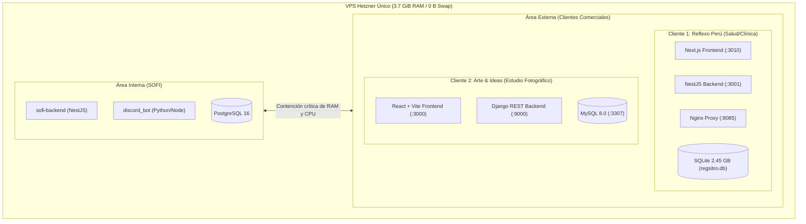

# Contexto Técnico: Desarrollo Externo y Clientes Comerciales en VPS

> **Documento de apoyo para la creación del slide de Proyectos Externos (Área Comercial RPsoft)**  
> **Servidor evaluado:** `root@178.156.246.18` (Hetzner Cloud - Ubuntu 22.04 LTS, 3 vCPUs AMD EPYC, 3.7 GiB RAM, 0 B Swap, 75 GB SSD)

---

## 1. Resumen Ejecutivo del Área Comercial

Mientras que el **Ecosistema SOFI** corresponde al desarrollo interno (asistencia y formación de practicantes), el área comercial de **RPsoft** mantiene proyectos en producción para clientes finales bajo esquemas de desarrollo a medida y hosting administrado (MRR).

En el servidor conviven actualmente **dos sistemas comerciales completos**, los cuales suman **6 contenedores Docker activos**, consumen más de **556 MiB de memoria RAM en reposo** y añaden dos motores de base de datos adicionales (MySQL 8.0 y SQLite de gran volumen) que compiten contra el PostgreSQL 16 de SOFI.



---

## 2. Detalle de Proyectos Externos en Producción

### Proyecto 1: Reflexo Perú (`Reflexo4`)

* **Cliente y Giro:** Cadena de centros de reflexoterapia, salud integrativa y bienestar holístico en Perú.
* **Propósito del Sistema:** Plataforma clínica y administrativa para la gestión integral de sedes:
  - Expedientes e historias clínicas digitales de pacientes.
  - Asignación de turnos, salas y agendas para terapeutas.
  - Control de citas médicas y catálogo de servicios terapéuticos.
  - Módulo financiero (ingresos, cierres de caja, facturación).
  - Emisión y descarga de reportes clínicos y recibos en PDF (operaciones con timeouts de hasta 300 segundos).
  - Sistema de tickets de soporte interno.
* **Ubicación en Servidor:** `/home/flexo/reflexo4`
* **Dominios Públicos:** `sistema4.reflexoperu.com.pe` / `app.sistema4.reflexo.pe` (SSL Let's Encrypt mediante Nginx host).
* **Stack Tecnológico:**
  - **Frontend:** Next.js (React) + TypeScript + Tailwind CSS (`ReflexoPeruV2-nextJS-Frontend-`, puerto 3010).
  - **Backend:** NestJS (Node.js/TypeScript) con arquitectura modular (`ReflexoPeru-V2-NestJs-Backend`, puerto 3001). Módulos: `appointments`, `medical-history`, `patients`, `therapists`, `finance`, `business-unit`, `locations`. Incluye documentación Swagger en `/docs`.
  - **Base de Datos:** SQLite monolítico montado como volumen en `/app/regsitro.db` con un archivo físico de **2.45 GB** (`regsitro.db`).
  - **Proxy / Red:** Contenedor Nginx local (`reflexo4-nginx-1`, puerto 8085) operando bajo `network_mode: host`.
* **Telemetría Real Registrada:**
  - Consumo de memoria RAM: ~121 MiB (~66 MiB Backend + ~52 MiB Frontend + ~3 MiB Nginx).
  - Almacenamiento en disco: 2.4 GB directos por el archivo de base de datos SQLite.

---

### Proyecto 2: Arte & Ideas (`Arte-Ideas---AV1-BK-FN`)

* **Cliente y Giro:** Empresa de servicios fotográficos profesionales, eventos y producción audiovisual.
* **Propósito del Sistema:** ERP/CRM vertical para estudios fotográficos:
  - Módulo CRM de prospección, clientes y seguimiento de leads comerciales.
  - Agenda digital de sesiones fotográficas, eventos y reservas de estudio.
  - Gestión de inventario de equipos fotográficos, trajes y utilería con alertas de stock.
  - Control de pedidos, flujo de producción (edición, impresión, entrega final) y contratos de prestación de servicios.
  - Dashboard analítico con gráficas interactivas de ventas y rendimiento comercial.
* **Ubicación en Servidor:** `/home/renso/app_despliegue/Arte-Ideas---AV1-BK-FN`
* **Dominio Público:** `app.arteideas.pe` (SSL Let's Encrypt mediante Nginx host -> `localhost:3000`).
* **Stack Tecnológico:**
  - **Frontend:** Single Page Application (SPA) construida con React 18 + Vite + Tailwind CSS + Lucide React + Recharts (gráficas) + jsPDF (`Av1-Frontend`, puerto 3000 -> 80).
  - **Backend:** Python con Django y Django REST Framework (DRF) (`Av1-Backend`, puerto expuesto 9000 -> 8000). Módulos: `crm`, `commerce`, `operations`, `finance`, `analytics`, `core`.
  - **Base de Datos:** MySQL 8.0 Oficial (`arteideas-db`, imagen `mysql:8.0`, puerto expuesto 3307 -> 3306, volumen `mysql_data`).
* **Telemetría Real Registrada:**
  - Consumo de memoria RAM: ~435.4 MiB (~350.5 MiB MySQL 8.0 + ~79.8 MiB Django + ~5.1 MiB Frontend Nginx).
  - Es el componente individual con mayor consumo de RAM en todo el servidor después del backend de asistencia.

---

## 3. Matriz Comparativa: Interno (SOFI) vs. Externo (Clientes)

| Atributo | Ecosistema Interno (SOFI) | Clientes Comerciales (Externos) |
| :--- | :--- | :--- |
| **Audiencia** | Practicantes y supervisores de RPsoft | Pacientes, terapeutas, clientes y staff externo |
| **Giro** | Formación técnica, LMS y asistencia | Salud/Clínica (Reflexo) y Fotografía/Eventos (Arte Ideas) |
| **Contenedores** | 5 contenedores activos | 6 contenedores activos |
| **Consumo RAM** | ~945 MiB (~25% de la memoria total) | ~556 MiB (~15% de la memoria total) |
| **Bases de Datos** | PostgreSQL 16 (Alpine) | MySQL 8.0 (Docker) + SQLite (2.45 GB en disco) |
| **Exposición Red** | Puerto 5432, 4000, 9090 | Puertos 3307 (MySQL), 9000 (Django), 8085 (Nginx Reflexo) |
| **SLA / Criticidad** | Control operacional interno | Compromiso comercial B2B con clientes externos |

---

## 4. Hallazgos Críticos de Arquitectura Cloud (Argumentación para la Defensa)

1. **Problema del "Vecino Ruidoso" (*Noisy Neighbor Effect*):**
   No existe aislamiento de recursos (cgroups, namespaces o máquinas virtuales independientes). Si el cliente de Reflexo genera reportes masivos en PDF o Arte Ideas ejecuta un reporte analítico pesado en MySQL, el consumo de memoria supera el límite del host (3.7 GiB sin swap) y el **OOM Killer** puede matar aleatoriamente procesos internos de SOFI o de los clientes.
2. **Proliferación y fragmentación de motores de bases de datos:**
   Tener 3 motores distintos (PostgreSQL 16, MySQL 8.0 y SQLite de 2.45 GB) en un único host de 3.7 GiB de RAM fragmenta los pools de memoria caché de disco (`innodb_buffer_pool`, `shared_buffers`, etc.) degradando el I/O global.
3. **Superficie de vulnerabilidad extendida:**
   Puertos de bases de datos comerciales como MySQL 8.0 están enlazados a `0.0.0.0:3307`, exponiendo la base de datos de producción de un cliente directamente a Internet.
4. **Justificación para la Migración AWS:**
   Este escenario sustenta la necesidad de separar las cargas mediante **AWS ECS Fargate / EKS**, **Amazon RDS** multi-tenant o segregado, y **VPCs aisladas**, garantizando que el desarrollo comercial no comprometa la plataforma educativa interna.

---

## 5. Código HTML Sugerido para el Slide

Este bloque está listo para copiarse en un nuevo archivo (por ejemplo `slides/03_b_clientes_externos.html`) y compilarse automáticamente con `python3 build.py`:

```html
<!-- SLIDE: DESARROLLO EXTERNO - CLIENTES COMERCIALES -->
<section>
  <h2 class="slide-title">Desarrollo Externo: Clientes Comerciales</h2>
  <p class="slide-subtitle">Cargas de producción B2B alojadas simultáneamente en el mismo servidor VPS</p>

  <div class="grid-3">
    <!-- Card 1: Reflexo Perú -->
    <div class="glass-card">
      <div class="pill-badge" style="margin-bottom: 12px;">Salud & Bienestar</div>
      <h4 style="font-size: 1.15rem !important; margin: 0 0 8px !important;">Reflexo Perú (Reflexo4)</h4>
      <p style="font-size: 0.88rem; color: var(--text-muted); line-height: 1.5; margin: 0 0 10px 0;">
        Sistema clínico y operativo para sedes terapéuticas: historias clínicas, citas, terapeutas, finanzas y reportes PDF.
      </p>
      <div style="font-size: 0.8rem; background: rgba(0,0,0,0.04); padding: 8px 10px; border-radius: 8px;">
        <strong>Stack:</strong> Next.js + NestJS + SQLite (2.45 GB)<br>
        <strong>Dominio:</strong> <code>sistema4.reflexoperu.com.pe</code><br>
        <strong>RAM:</strong> ~121 MiB | 3 contenedores
      </div>
    </div>

    <!-- Card 2: Arte & Ideas -->
    <div class="glass-card">
      <div class="pill-badge success" style="margin-bottom: 12px;">Estudio Fotográfico</div>
      <h4 style="font-size: 1.15rem !important; margin: 0 0 8px !important;">Arte & Ideas</h4>
      <p style="font-size: 0.88rem; color: var(--text-muted); line-height: 1.5; margin: 0 0 10px 0;">
        ERP/CRM integral para estudios de fotografía: prospección comercial, agenda de sesiones, inventario, contratos y métricas.
      </p>
      <div style="font-size: 0.8rem; background: rgba(0,0,0,0.04); padding: 8px 10px; border-radius: 8px;">
        <strong>Stack:</strong> React 18 + Django DRF + MySQL 8.0<br>
        <strong>Dominio:</strong> <code>app.arteideas.pe</code><br>
        <strong>RAM:</strong> ~435 MiB | 3 contenedores
      </div>
    </div>

    <!-- Card 3: Riesgo Operacional -->
    <div class="glass-card" style="border-left: 4px solid var(--danger);">
      <div class="pill-badge danger" style="margin-bottom: 12px;">Riesgo Arquitectónico</div>
      <h4 style="font-size: 1.15rem !important; margin: 0 0 8px !important;">Efecto Vecino Ruidoso</h4>
      <p style="font-size: 0.88rem; color: var(--text-muted); line-height: 1.5; margin: 0 0 10px 0;">
        Coexistencia no aislada: 3 bases de datos (PostgreSQL, MySQL, SQLite) disputando I/O y memoria sin swap.
      </p>
      <div style="font-size: 0.8rem; background: rgba(239, 68, 68, 0.08); padding: 8px 10px; border-radius: 8px; color: var(--danger);">
        <strong>Impacto:</strong> Una saturación de clientes externos provoca el cierre abrupto de la plataforma SOFI por OOM Killer.
      </div>
    </div>
  </div>
</section>
```

---

## 6. Guion Rápido para la Exposición Oral del Compañero

1. **Introducción:**
   *"Así como tenemos el desarrollo interno con SOFI, RPsoft genera ingresos comerciales manteniendo sistemas para clientes en producción alojados exactamente en el mismo servidor."*
2. **Presentación de proyectos:**
   *"Actualmente soportamos dos plataformas comerciales: **Reflexo Perú**, un sistema clínico de reflexoterapia con backend en NestJS y frontend en Next.js; y **Arte & Ideas**, un ERP/CRM para estudios fotográficos sobre Django y React."*
3. **El conflicto técnico fundamental:**
   *"El problema crítico aquí no es que existan clientes comerciales, sino que **no hay separación de cargas ni aislamiento**: conviven MySQL 8.0, PostgreSQL y una base SQLite de 2.45 GB en una máquina de 3.7 GiB de RAM sin Swap. Un pico de demanda comercial tumba el bot de asistencia de los practicantes, lo que justifica nuestra propuesta de migración y desacoplamiento en AWS."*
